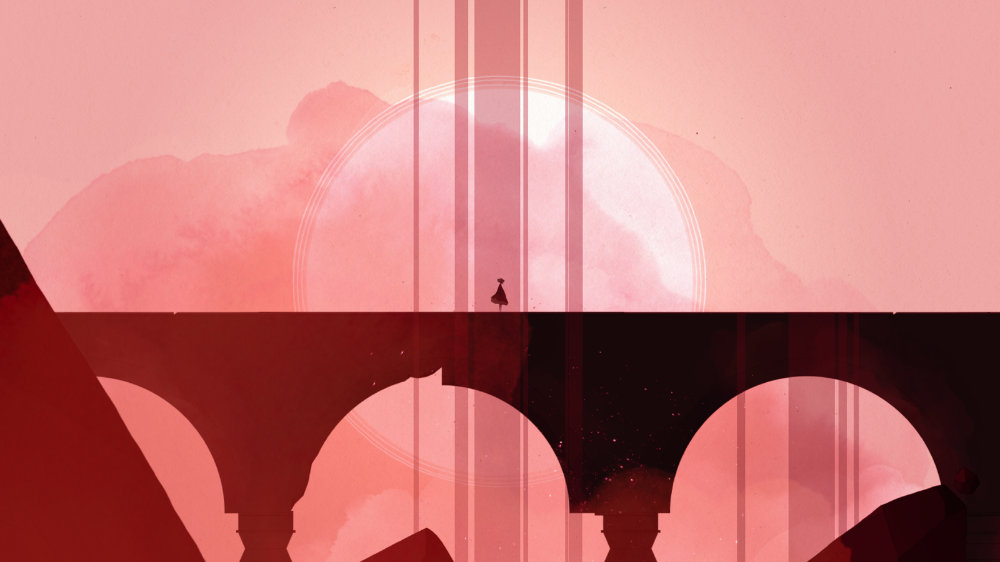
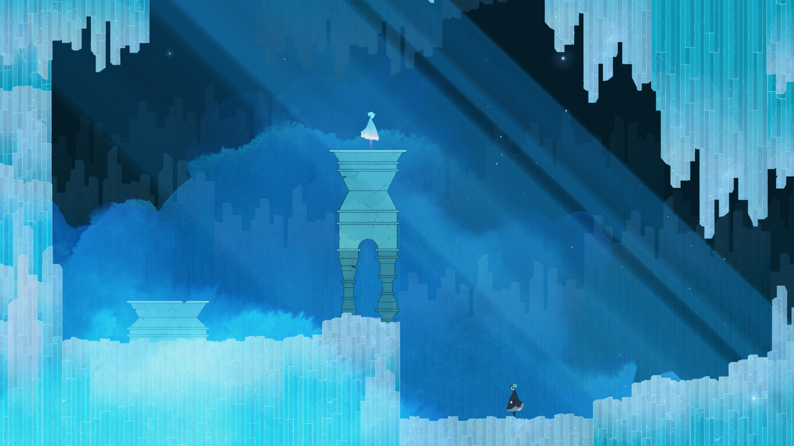
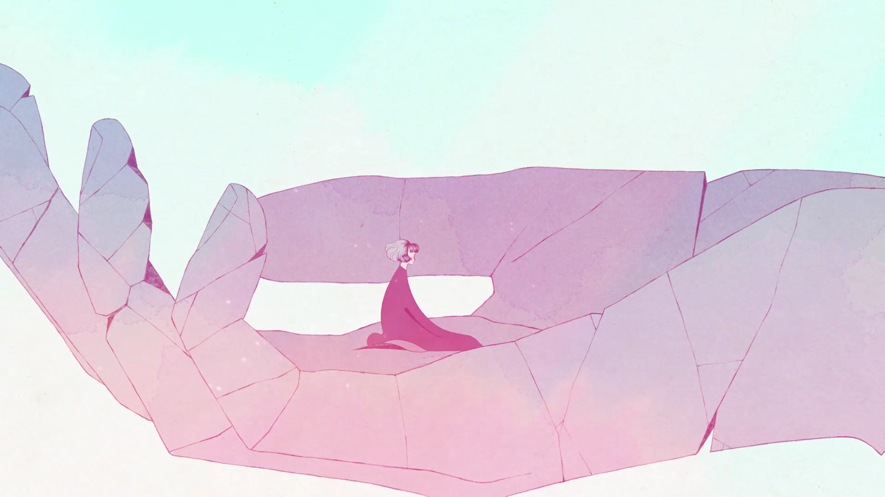

## [Journey](https://www.epicgames.com/store/en-US/product/journey/home) and [Rime](https://store.steampowered.com/app/493200/RiME/) fans, this is for you

1. Tells a powerful story without a single word
2. Game mechanics are explored, not explained
3. Puzzles that reward you with "a-ha!" moments
4. Smooth and detailed animation and sound effects
5. Ingenious and polished level design
6. Relaxing and meditative ambient music
7. Breathtaking visuals, in terms of scale and usage of color
8. You will sometimes slowdown or stop to appreciate the moment
9. Your mind will wander, looking for meaning in every detail
10. It will hit your feelings
     - _a tissue box is just as important as a game controller_

This is an art game, it's a whole experience.

**The game plays _you_ more than you play _it_.**

I was playing alone, yet multiple times I had to verbalize a "that's so clever" or a "this is gorgeous". Often I found myself with a silly tender smile on my face. Or noticed my mouth was open in awe for the last minute.

When I finished I was shaken.

I felt the need for a hug. I felt empty, like left behind by the game.

This is one of the best games I played in my whole life. [Your turn.](https://store.steampowered.com/app/683320/GRIS/)
