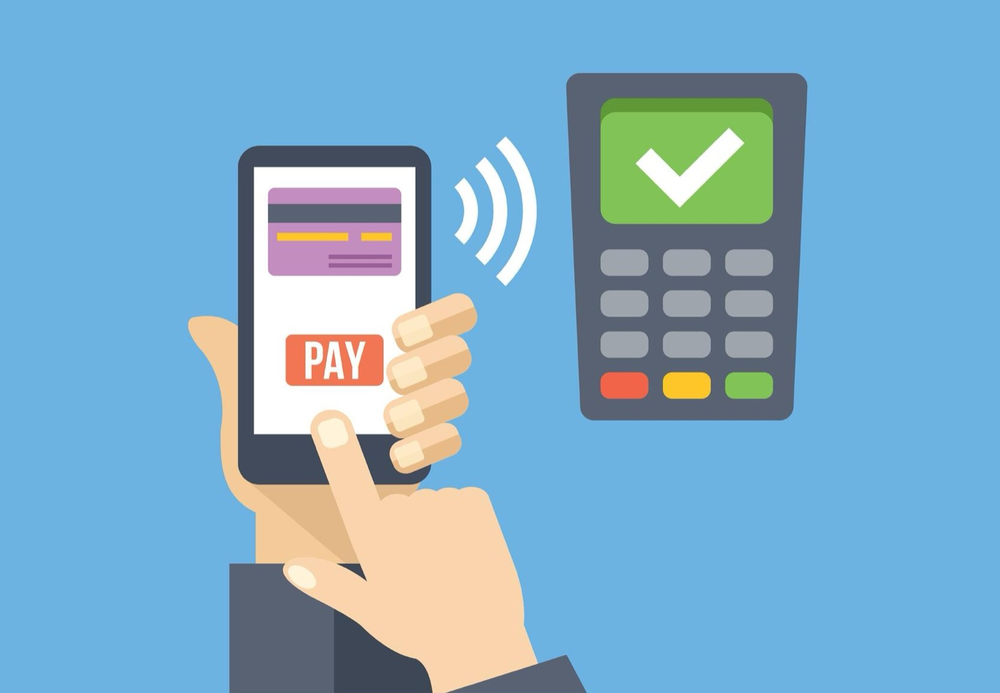
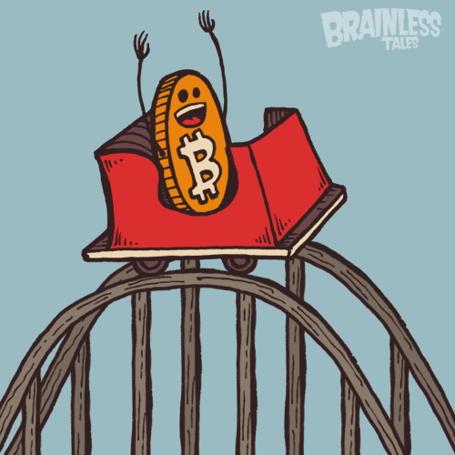
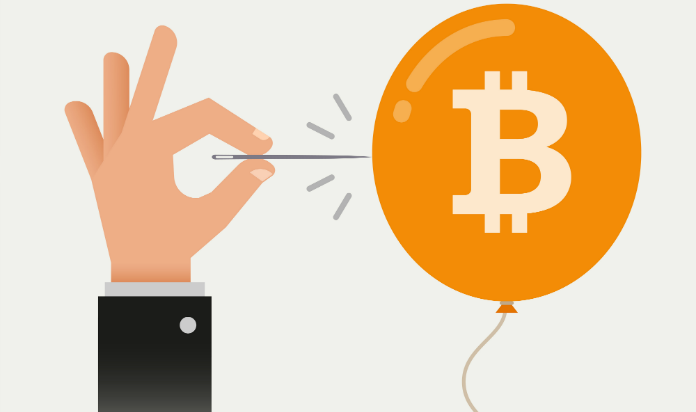
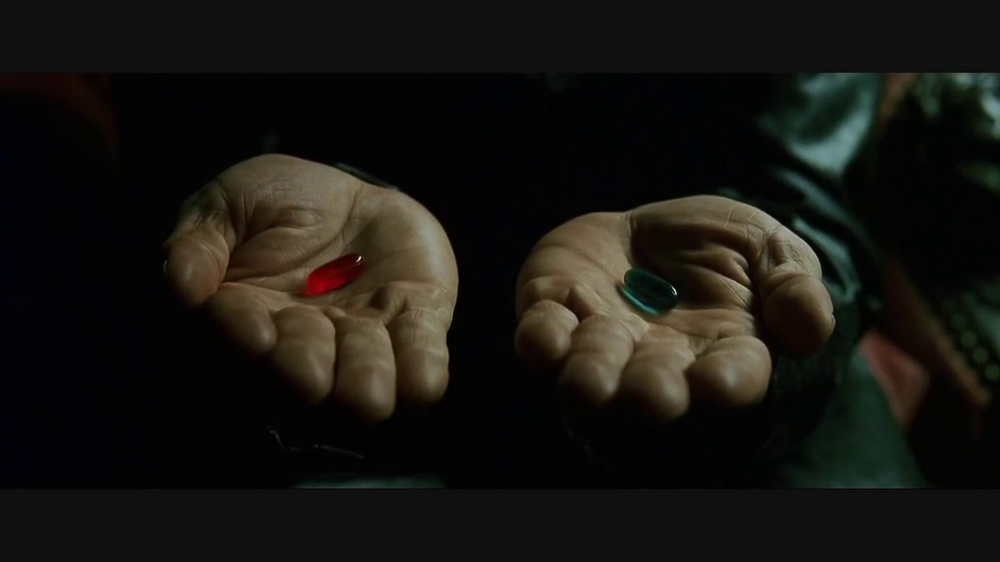

Bitcoin launched in 2009 and Ethereum in 2015. At the time of writing, there are over 830 virtual currencies or assets. If you heard these names and have no idea what they mean, this post is for you.

_DISCLAIMER: The target audience of this post is non-technical. I used analogies to explain these complex abstract technologies. Sometimes at the cost of technical accuracy. I hope you can endure it._

## What is it?

**Bitcoin is a digital currency**. You can think of it as another fiat currency, like Dollars or Euros. It's a "thing" that has value to many people and that you trade with someone else in exchange for goods or services. Except it is digital, intangible yet real, like your accounts' balance on your home banking website. In the (near) future, you might use it like [Apple Pay](https://www.apple.com/apple-pay/).

**Ethereum is a platform that runs code**. Let's say you transfer money from your bank account to your friend's account. Your bank doesn't send a person to physically deliver that money to your friend's bank, like a pizza boy. Instead they have a "smart contract" between both their systems to digitally perform that transaction. Ethereum is a tool to write and run those contracts, and they are not limited to finance.

**Alternative Coins** (aka. AltCoins) or **Cryptographic Currencies** (aka. CryptoCurrencies) are variants (aka. forks) of currencies like Bitcoin or tokens like Ethereum. Since these technologies are open-source, meaning their "blueprints" are public, anyone can make an improved version or a plain copy. Here are a few examples:

- **[Dash](https://www.dash.org/)** is a competitor to Bitcoin. It claims to be faster, more anonymous, and easier to use.
- **[Litecoin](https://litecoin.org/)** is a useful copy of Bitcoin, "if Bitcoin is gold, then Litecoin is silver".
- **[Dogecoin](http://dogecoin.com/)** is a useless "meme coin", created in 2013 to prove that anyone could copy Bitcoin.
- There are also "shit coins" and "scam coins". Usually someone makes a copy, changes the name, and announces a super-duper new coin. People invest in the scam coin, fuelled by hype. The scammer takes the money and investors discover too late that the coin is useless and their money gone.

## Why is it so popular lately?

**First, because it is a tech breakthrough.** And its name is [blockchain](https://en.wikipedia.org/wiki/Blockchain). Actually, Bitcoin is just an use of that technology, much like Dropbox is powered by the internet. The blockchain solves the problem of distributed consensus. That allows a network of machines to agree on something without having a central authority. Such networks are extremely resilient. With an increasing number of connected devices technologies like the blockchain come in handy.

**Second, because we never had an unregulated digital currency.** Bitcoin has many advantages over regular fiat currencies:

- You are your own bank; thus (1) you don't have to pay a bank to store your money and (2) your money is always with you and you are safe from bank's bailing out.
- Everything is decentralized; thus (1) authorities and regulators can't shutdown the Bitcoin network and (2) no one can tax your wealth.
- Transactions and balances are public but identities aren't; thus no one knows with who you are doing business.

**Finally, because it is an exciting investment.** No one knows the real value of a promising new digital currency like Bitcoin. When it started, each coin was worth 1$, then 100$, then 1000$, and lately ~3000$~ 5000$. Ethereum was the latest coin with the fastest growth. The early investors became millionaires in a few years or less. The gossip spreads, then it's all over the internet, then it reaches national TV. Fear of missing out (FOMO) this opportunity kicks in and suddenly everyone wants to buy. Demand raises prices, we enter a bull market and the bubble grows.

## What am I buying?

**Dreams**. Someone has a vision and creates a currency or token. They have a team, hopefully a prototype and at least a white paper that describes their value proposition, together with a roadmap. You're betting on that team's vision, that it will become true, useful and valuable.

> High uncertainty => High risk => High reward if it works (or zero otherwise)

**Currencies.** They have the same function as your country's currency. Except they are digital, don't have a central bank and provide additional features (e.g. instant transactions, privacy, etc.). Examples: [Bitcoin, Dash, Monero.](https://coinmarketcap.com/currencies/views/all/)

**Tokens.** They contain a piece of code used on a "smart contract". They are the physical representation of a physical good (like a document) or digital good (like one hour of computational power). Examples: [Ethereum, Golem, Siacoin](https://coinmarketcap.com/assets/views/all/)

To keep things simple, **everything is an asset**. As an investor you can think you are buying stocks or shares of a company. If the currency/token the company is selling has increasing adoption and demand, then the price of each share company's market value increase and so does your portfolio.

> _Example_: Let's say you are in 2008 and the new "Bitcoin Corporation" creates 1 million ~bitcoins~ shares priced at 1$ each. Anyone can buy it, but no one trusts it or has an use for it. You take the risk and invest 100$ to buy 100 ~bitcoins~ shares. A few years pass and the general public realised the advantages of using "Bitcoin Corporation"'s product. Suddenly you have a million people demanding to buy ~bitcoins~ shares. Surely those ~bitcoins~ shares you bought years ago are now worth a lot more than 1$. So you ask 10$ for each one, like every other Bitcoin investor. You sell your ~bitcoins~ shares to someone willing to pay that price and you profit.

## How can I make money?

**You can be a day trader.** Someone that profits from the daily fluctuations of this coins. You should only consider this option if you have experience on trading/exchanges and knowledge on how to read charts and tendencies.

Since you are holding the assets for short periods of time, the difference between buy and sell prices tends to be also small. Unless you are investing on volatile altcoins, on each transaction you will be profiting a few cents per coin.

Thus, to generate relevant profits, you'll need to trade a lot of coins a lot of times during the day. That's a highly risky. Not to mention that you will be competing against trading bots. That's why this profile is suited for senior and wealthy investors (aka. whales).

> _Example_: You notice that Digibyte's price rises and falls a lot during the same day. Hence, you place a buy order of 500.000 DGB at 0.010$ (total 5.000$). The transaction is made and immediately you place a sell order at 0.015$. After 3 hours, the transaction is made and you gained 0.005$ per DGB, a total of 2500$.
>
> You wait until the price corrects back to 0.012$ and invest 5000$+2500$, this time getting 625.000 DGB. Following the same strategy, you place a sell order at 0.018$ and wait. And wait. But the price doesn't rise and the correction ends on the initial 0.010$. The day ends and you can't fall asleep. Tomorrow is another day.

**You can be a holder (or [hodlr](https://www.reddit.com/r/Bitcoin/comments/5yhnbi/where_did_the_hodl_meme_come_from/)).** Someone that buys with the goal to sell long-term. For these investors, buying altcoins is like buying shares of a company or units of an index fund — you buy it and forget it for six months to one year.

If you wait long enough, and if you placed your bets on the right altcoins, the effect of volatility and market crashes will dilute in time. To maximise long-term profits, they buy low when there's FUD (Fear, Uncertainty and Doubt) and wait patiently for those assets to grow in value.

So, when do these investors collect profits? Holders usually set a percentage or a time. When the investing period ends or the assets reaches the desired profit percentage, the investor trades the coin for fiat and takes the money he/she invested initially plus the profit.

> _Example_: You see the long-term potential of Dash. Hence, you decide to invest 1000$ and buy 10 units. At the same time, you set your goals: "I will sell my Dash next year or when its price increases 200% compared to its current price." You leave your Dash on your wallet and go live your life.
>
> Eight months later you notice the price has already increased by 200%. One of your goals was achieved, so you sell all of your Dash and get 2000$. Now you have to decide if you spend it or reinvest it on another promising altcoin. Rinse and repeat.

## Will I lose money?

Yes, that's likely. This is a high risk, high reward environment. There are ways to minimize your losses though: meticulous research on altcoins and general trading, good timing on entries (buy) and exits (sell), staying up to date with the news on the crypto world… and luck too.

Picture the crypto currency market like a wave. The wave is unstable and unpredictable. If you are a day trader, your investments (and your mood) will rise and fall with the markets. If you are in this for the long run, you [let yourself go](https://www.youtube.com/watch?v=L0MK7qz13bU), ignoring the journey and yearly checking how close you are to the destination.

Here are the most frequent community advices to newcomers:

- The best time to ~plant a tree~ invest in Bitcoin was 10 years ago. The second best is now.
- Sell during hype (bull market). Buy during depression (bear market).
- Due your own diligence before investing.
- Investing without research is just gambling.
- Don't invest more than you can afford to lose.
- Don't put your eggs on the same basket.

## What should I do?

> I can only show you the way. The path is for you to take.
>
> — Morpheus. (Matrix, 1999)
