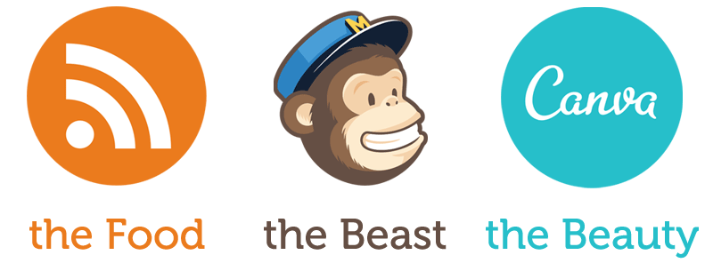
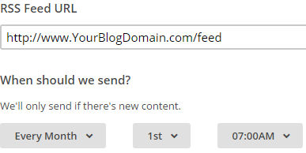
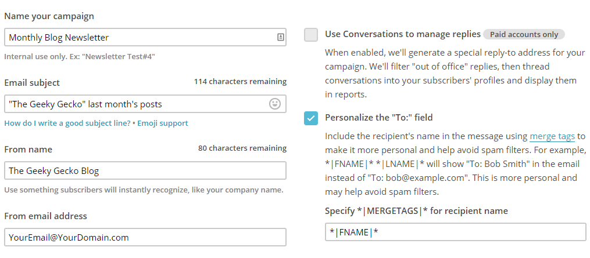
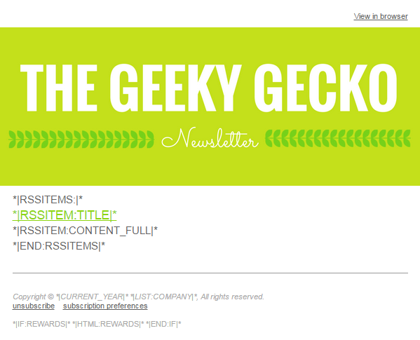
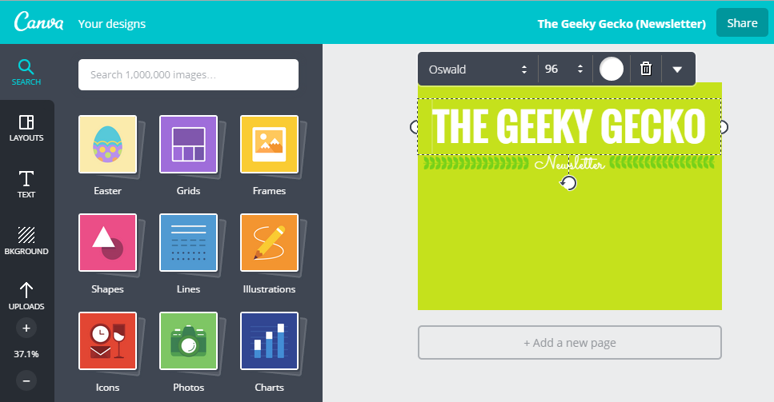
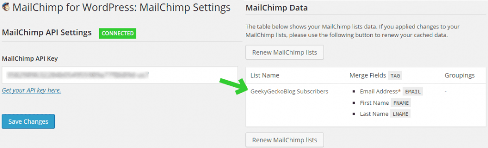

You have a blog and an RSS feed announcing your posts. If you're ~lazy~ efficient like me, you already take advantage of that RSS through [IFTTT](https://ifttt.com/) to **automatically share your posts on your favorite social networks**. You probably remember me mentioning this awesome service on ["Software too good to be free"](/blog/software-too-good-to-be-free/). It's really easy to set up the If This Then That rules -- there's no coding involved, just clicking on big colorful icons. You'll be amazed with the amount of time you'll save up!

**However, not all of your audience uses social networks and you're not reaching them.** Wait, what? How can those persons live without ([deep inhale](https://www.youtube.com/watch?v=7RrNVrsgVXk&feature=youtu.be&t=10s)) Facebook, Twitter, Google+, LinkedIn, Pinterest, Tumblr, Reddit and StumbleUpon? The point is, if you focus your channels strategy solely on such platforms you’re leaving behind a substantial audience. If your audience doesn't use social networks, they'll never hear about you. If they do use, they might not notice you in the middle of all those selfies, vacations, fails, and motivational quotes.

You should give your audience the opportunity to subscribe directly to your updates.

_But that's what an RSS is for!_

You're right, but not everyone knows or wants to use one.

_Fine, what does everyone use after all?_

[**Email.**](http://www.adweek.com/socialtimes/email-vs-social/504069)

## Part 1: The email newsletter

Thankfully, you can put technology to work for you -- that's why it was created. And when we speak of email, newsletters, subscribers, and signup forms, all in the same sentence, we must include another word: [MailChimp](http://eepurl.com/bf5nQT). Although they have a [tutorial](http://blog.mailchimp.com/rss-to-email-tutorial/) about their RSS-to-Email feature, it's highly outdated. So let me walk you through the process.

> We're about to create an automatic newsletter that reads your RSS feed and monthly sends an email to your subscribers listing the posts you published during that month.

1. Create a [**MailChimp account**](http://eepurl.com/bf5nQT).
2. Log in. On the top navigation bar, click **Lists** and then click the **Create List** button. In time, this list will contain the subscribers of your email newsletter. Fill in the required fields.
3. On the top navigation bar, click **Campaigns**, then click the dropdown icon of the **Create Campaign** button and finally select **RSS-Driven Campaign**.
4. Type your **RSS feed's URL**. If you don't know it, type your blog's URL and they find it. Select your **newsletter frequency**.
5. You'll be asked to choose the list that will receive the newsletter. Pick the list you created on step 2 and select **Send to entire list**.
6. Fill in your **Campaign Details** as desired. Here is mine if you need inspiration.
7. Select the visual structure (**Template**) of your newsletter. Pick visual components from the **Contents** sidebar and drag-and-drop each one of them to your newsletter template. I added an Image (newsletter banner), an RSS Items (the actual content of the email), and a Divider.
8. Edit your **Contents** components to fit your taste and needs. I simplified the default header and footer. I also aligned the hyperlinks' color to fit my color scheme. The trickiest part is playing with the RSS merge tags, those `*|RSSITEM:TITLE|*` codes, here's the [list](http://kb.mailchimp.com/merge-tags/rss-blog/rss-item-tags). Try, preview, tweak and repeat until your happy with the result. 
9. Press **Next**. Done!

You now have an automatic creation and delivery of newsletters. You're a genius!

## EXTRA: The newsletter banner

That newsletter looks awesome, isn't it? I'm a techie not a designer, but sometimes I need to create good-looking media like that banner. **[Canva](https://www.canva.com/) brags that it turns anyone into a designer**, so I gave it a try. Basically it's an online service that lets you create posters, flyers, banners, infographics and social networks' covers, all by this by using the drag-and-drop method.

They have a ~wide~ range of shapes, icons and photos that you can use for free. They also provide templates and examples for you to get started. Their range of fonts is awesome. Now it all rests upon your creativity.

## Part 2: The signup form

You have the newsletter ready to be sent... but to whom? Probably you already about some close friends that might want to receive the newsletter. For those, you can save them the effort of signing up and include them right away on the list you created over at **Step 2**. Afterwards, what you really need is to setup some kind of form for your visitors to enter their email addresses.

1. Install [MailChimp's official plugin for Wordpress](https://wordpress.org/plugins/mailchimp-for-wp/). Afterwards, a new option named **MailChimp for WP** will appear on your Wordpress' sidebad. Click it.
2. Fill in your **Mailchimp API Key** by pressing the "Get your API key here" link. Your **Lists** will be automatically imported.
3. Now, to create the signup form, on your Wordpress' sidebar click on **MailChimp for WP » Forms**.
4. Configure the form as desired. For **CSS Style** I chose "Dark theme" (try one, preview, try another). Your form should subscribe to the list you created in the beginning of this tutorial. Don't forget to review the **Form Settings & Messages** section for custom messages. When you're finished press the **Save Changes** button.
5. Your form is configured, now you need to add it to your blog. On your Wordpress' sidebar click **Appearance » Widgets**. Drag the **MailChimp Sign-Up Form** widget to one of your blog's widget areas. Give it a title, press **Save**.
6. Press **Save** and check your website's widget area.

Now sit back, write interesting content and let the internet chimps do the dirty work.

_Credits: [Round RSS Icon](https://www.iconfinder.com/icons/309964/rss_social_socialpack_ubercons_icon#size=64) by André Swanepoel. Trademarks belong to their respective owners._
