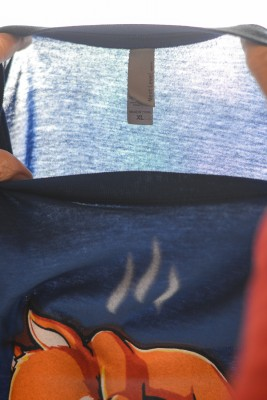
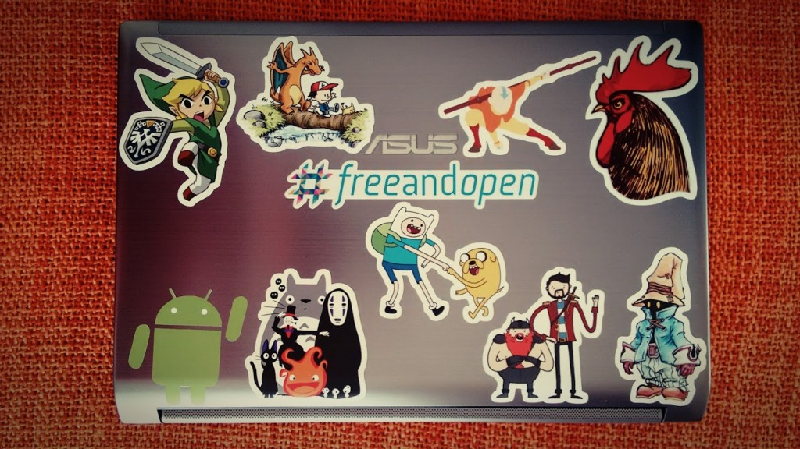

## It's called RedBubble and offers high quality & variety at fair prices.

For me, interests define persons -- books, movies, games, series, things that make you belong to a tribe of fans. Like with soccer team, you like to show off that you support a specific team. Some show their support by giving it a cheap "like", others by bravely wearing a t-shirt or sticker.

It all started when I found [Day of the Shirt](http://dayoftheshirt.com/), a website that aggregates lightning deals of t-shirts. The t-shirts' designs are usually a pun or a cross-over from different pop culture references, like Lego + Cosmos or even Game of Thrones + Calvin and Hobbes. These deals come from companies that sell _a single design_ for a limited time at a great price (minus shipping). It's great for starters but you'll soon run into some problems.

I made two purchases. One was from _TeeGlobe_ (EU): clever design, fair shipping, great quality and nice fitting. I enjoyed it so I bought again from another vendor, _TeeTurtle_ (US): they have the cuttest designs you can find, paired with the worst quality and customer support. The t-shirt was too long and the material looked like it was about to vanish into thin air. I complained to their customer support about the quality and the shipping prices; they replied that that was their standard quality and that I would get a refund after I paid to return the t-shirt. I refused to pay for their mistake and they refused to refund me.

While the deals may tempt you at first, the **reduced designs**, the **random quality**, and **random price + shipping**, scared me away. Never again.

## Then I saw the light

And it was red... [RedBubble](/blog/RedBubble). They have a perfect business model. Artists anywhere provide the designs and get a good % on every sale. Even you can upload your designs or photos and get a chance to make some money! Since they crowdsourced the "images", they just have to focus on printing those "images" on high quality "stuff" and send it to your address. And their "stuff" ranges from clothing and stickers to bags and home decor.

[Each design is often available on multiple products](/blog/RedBubble), thus if you for instance like a sticker you can also buy the pillow version. They even have designs about [Swords and Sworcery](/blog/RB-SwordSworcery) and that's pretty underground! [T-shirts](/blog/RB-TShirts) are legit Americal Apparel quality, _'nuff said_. For that you pay between 18€ to 21€. If you buy +6 [stickers](/blog/RB-Stickers) you get an immediate 50% discount on them. They ship everywhere with fair prices, and during checkout it's easy to find 10% discount coupons. What else do you need?

If you're not convinced yet (you should!) listen to this. I ordered two t-shirts, but one of them should be woman fit, instead I ordered two unisex t-shirts. My bad. Still I sent an email asking for a replacement.

> I'm more than happy to get you that shirt in a size that's going to work for you. I've gone ahead and organised a re-print. Expect it in 10-15 days.

Wow, that was quick! But what do I do with the other t-shirt?

> There's no need to return it to us - Go ahead and keep it or donate it.

Now this is a customer support truly concerned with customer satisfaction!

## Conclusion

Buy at [Redbubble](/blog/RedBubble), not because I tell you to, but for these reasons:

- You're directly supporting the artists
- Designs for all your interests
- Excelent price/quality relation
- Wide variety of physical products
- Possibility to print your own custom designs
- Gracious customer support
