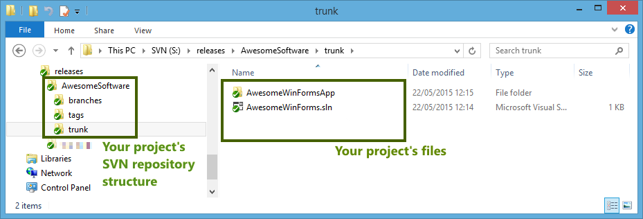
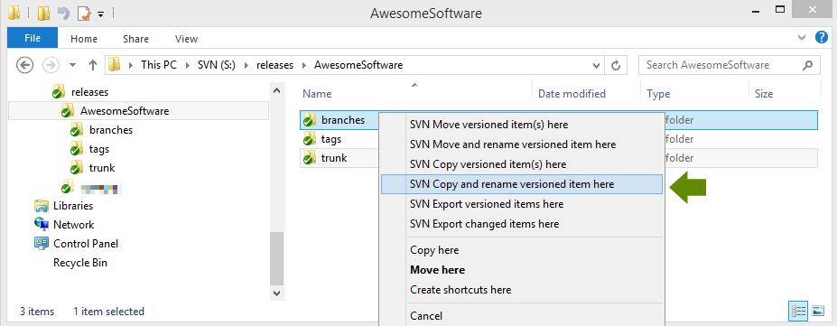
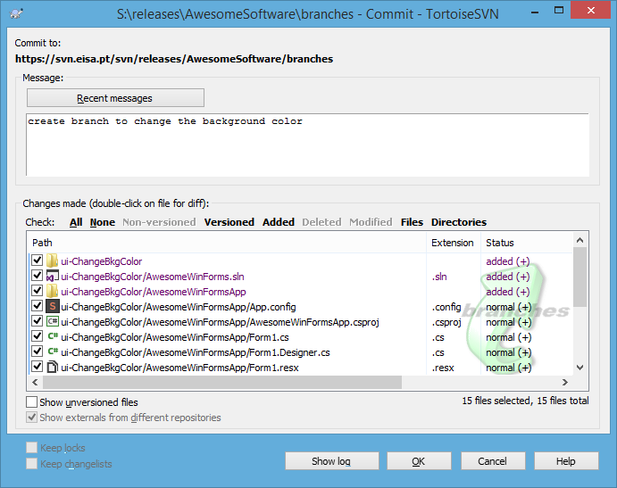
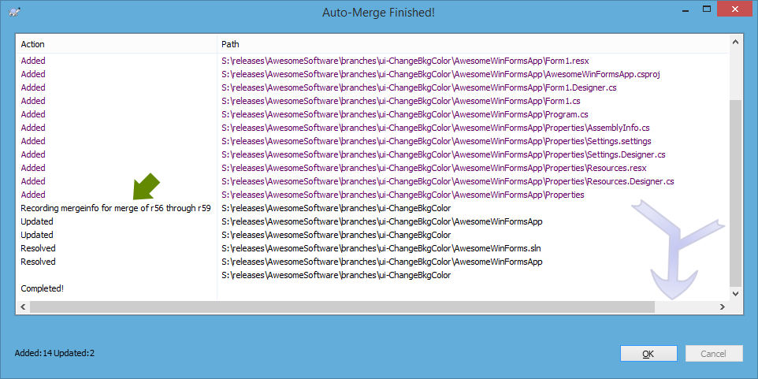
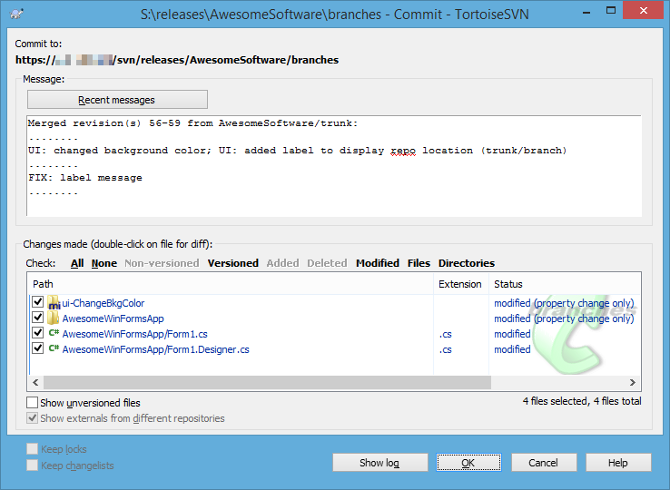
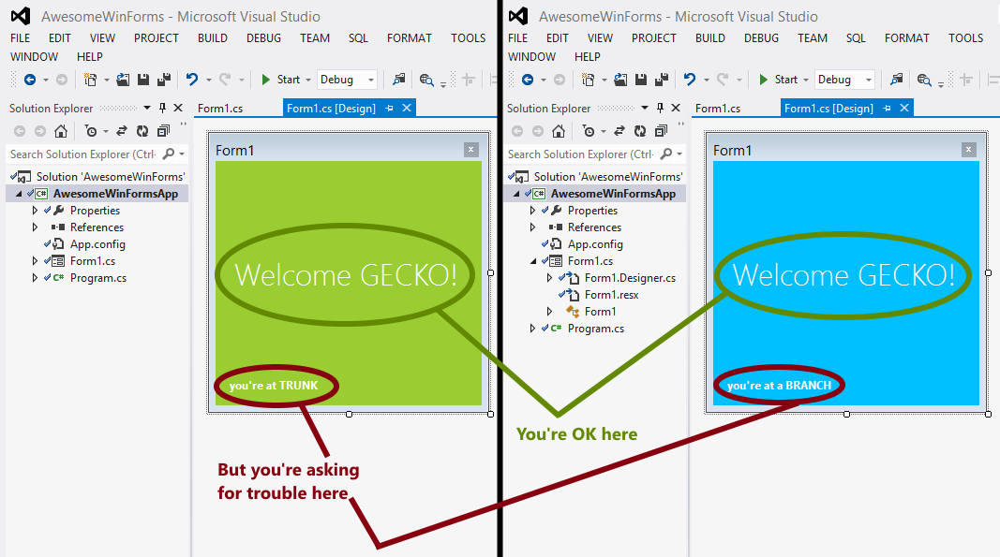
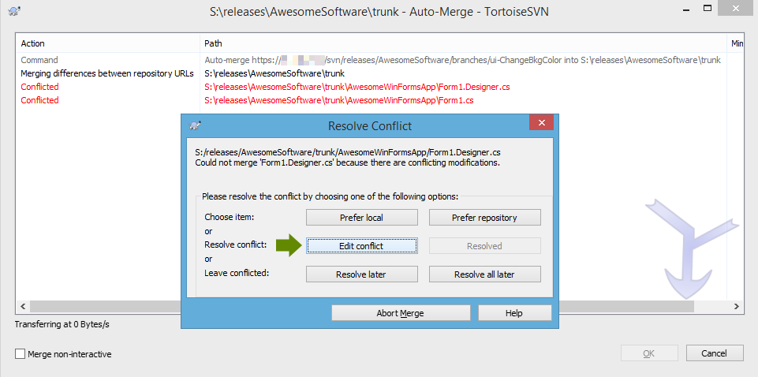
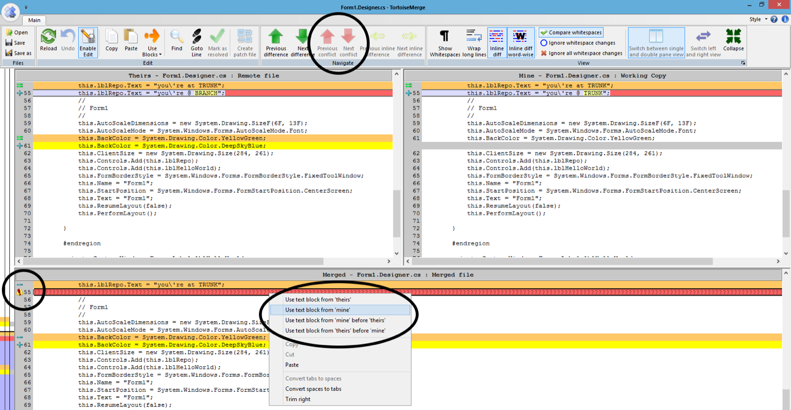
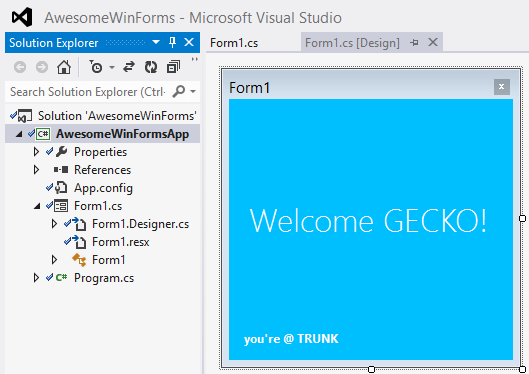

If you don't know what branches are and why they're used for, read [this](http://guides.beanstalkapp.com/version-control/branching-best-practices.html) first.

## Creation

First make sure your project follows the standard SVN folder structure, i.e. the `trunk`, `tags` and `branches` folders. All your code, resources, dependencies, and everything else you might need to compile a version of your software should live inside the `trunk` folder.

Before creating a branch, perform an update on your `trunk` folder and commit all pending changes. If your using Tortoise SVN a green checkmark overlay should appear on your folder. You're ready to branch your `trunk`!

1. Select your `trunk` folder.
2. Click and hold the right mouse button and drag it over to `branches`. If done correctly, a cascade menu will appear. Select **SVN Copy and rename versioned item here**. 

3. Then you'll be asked to name the new folder (actually you're naming the branch). Use any convention you like -- maybe `feature-Ticket12345` or something more human-readable as `fix-CrashAfterEmptyInput`. I like to use prefixes, such as `feat` for features, `fix` for bug corrections, and `ui` for user interface tweaks.

4. At this time, you have a full copy of your `trunk` folder at `branches/your-branch-name`. To add it to your SVN just right-click it and commit. Don't forget to ignore build-generated files.

## Usage

A branch is just a parallel copy of `trunk`. Your branch is **isolated** from the `trunk` changes and vice-versa. Feel free to develop wild stuff on your branch. At any time, anyone can checkout the `trunk` folder in order to commit or build something and they won't get affected by your changes.

Both a team or an individual may work on a branch. If you're working alone you don't have to worry about locking files, but if two or more developers are working on the same branch, locks work as they did on `trunk`. Keep in mind that locks made on `trunk` do not affect other branches' locks and vice-versa.

In conclusion, you may lock, commit, or update as you did on any regular `trunk`.

## Keep it up-to-date

Now this is where it starts getting interesting... and tricky. Remember the isolation between `trunk` and `branches`? That's a (dis)advantage. Sometimes you need to update your branch with the developments made on `trunk`. However, you don't want to create a new branch or lose the work/commits you already have on your branch.

> Example: You're working on translating your application. Someone commits on `trunk` new forms. Those forms need to be translated too, but when you created your branch they didn't exist. How can your branch receive those new forms (commits) without ruining your work?

**Updating your branch with the most recent version of `trunk` is called "merge" on SVN**, while [git](https://git-scm.com/) calls this process [rebasing](https://git-scm.com/book/en/v2/Git-Branching-Rebasing). For newcomers this may cause confusion since "merge" is also what you do when you definitively integrate your branch into trunk. Right now you're not actually merging anything definitively -- you're just "updating", like you did when you were at `trunk`.

1. Ensure your branch does not have uncommitted changes.
2. Right-click over the branch folder you want to update (not the parent `branches` folder). Select **TortoiseSVN > Merge...**.
3. A wizard window will appear.
    1. Select **Merge a range of revisions**. Next.
    2. On **URL to merge from** type the URL to the `trunk` folder. Then select **All revisions**, since you want to update your branch with all revisions of `trunk` since your last update. Next.
    3. At merge options you'll probably want to leave all the defaults. You can press **Test merge** to do just that -- TortoiseSVN will give you a preview of the actions that will be applied during the merge (add, remove, update, conflict), without changing any local or remote files.
    4. If you're comfortable, do it, press **Merge**.

At this point, your local branch is a merge between what you had and the latest developments on `trunk`. You may want to run a couple of tests just to guarantee that SVN's auto-merge didn't break anything. If your merge produced conflicts and you had to manually resolve them, them YOU MUST test all code involved in those conflicts. You'll thank me later.

Your branch continues equally awesome after the merge? Great, then it's time to commit your branch, and continue your work. TortoiseSVN will even suggest a commit message, a concatenation of messages from the commits that you just finished merging.

**The more often you merge** with `trunk`, the less code you'll have to merge each time, thus reducing the probability and complexity of conflicts.

## Integrating a branch into trunk

The time has come. You developed and tested an awesome feature at your branch in (almost) complete isolation. Now it's time to merge those equally awesome lines of code into the `trunk`. The process is basically the same as updating a branch, except this time you're **updating your `trunk` with the commits of your branch**.

1. Ensure your `trunk` does not have uncommitted changes. And that you finished working on your branch. And that you just finished updating your branch with the latest version of trunk. And that the stars are all aligned.
2. Right-click over the `trunk` folder. Select **TortoiseSVN > Merge...**.
3. A wizard window will appear.
    1. Select **Merge a range of revisions**. Next.
    2. On **URL to merge from** type the URL to a specific branch folder. Then select **All revisions**. Next.
    3. At merge options leave the defaults.
    4. Press **Merge**.

Like when updating your branch, your local `trunk` is now a merge between what it had and your branch's developments. Since this is the `trunk`, run all necessary tests before commiting. After commiting your new `trunk` you may safely delete your branch. If you find a bug, just create a new branch and repeat the process.

## Conflicts

Conflicts are the flavor of life. Imagine Lord of the Rings without the all those ugly orcs and Uruk-Hais -- pretty tasteless right? A conflict happens when you and someone else edit the same line of code differently. The next time you try to merge both code sources a conflict will arise, since SVN doesn't know which line of code to use. Who's right? Your line or your colleague's?

In this cases you have to manually resolve the conflict. That means reviewing the file where the conflict happened and choose which version is legit. In this example, I made a change on `trunk` and a different change at the same line on `branches`. When I tried to merge the branch into the `trunk` this happened:

SVN tried its best to merge the files but we ended up with two conflicting files. Time to put on the gloves and click **Edit conflict**. TortoiseSVN will open a 3-pane window with your local version (mine), the repository version (theirs), and the merged file preview.

Focus only on conflicts by navigating using the **Previous/Next conflict arrows**. Have a look at the **Merged pane** (bottom). SVN is telling that line `this.lblRepo.Text = "you're at TRUNK";` was removed and replaced by... well, SVN needs help deciding, it has two possible candidates, as you can see in the **Theirs pane** (left) and **Mine pane** (right).

You can either right-click the line full of `???????????????????????` or press the **Use block** button located at the Ribbon. Both will allow you to specify which block of code to use. In this case, I decided to **Use text block from 'mine'** (since after the merge I'll be on trunk, so that's the message I want to keep).

After you resolve the file's conflicts you can press **Save** and close the window. You will return to the SVN dialog box where you decided to edit the conflict, except this time you'll click **Resolved**. Rinse and repeat for the remaining files with conflicts.

Remember to test your code after a manual merge.

## Conclusion

Mission accomplished.

What started as a green window is now blue, and the developers working at `trunk` were never disturbed by intermediate or unstable commits -- all thanks to the power of branches.

As a last step you should delete the branch. Its code is already on `trunk`, its revision history on SVN, so you no longer need it. Delete it now and avoid confusions later.
