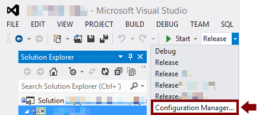
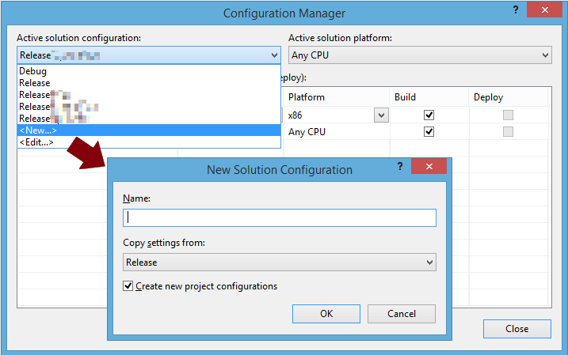
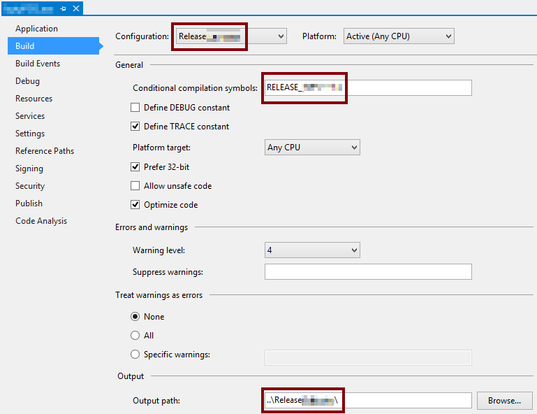
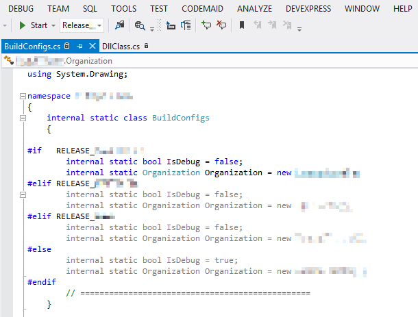

Sometimes you might need your application to behave differently according to different clients, or different operating systems, or any other criterion. You could create global variables, initialize them on your application's startup, and scatter `if` statements over your code. What you should do is use the "State" design pattern instead, but for little and localized differences that might be overkill.

The lean solution is to use VisualStudio's build configurations. They offer more flexibility, improve code readability, and ease debugging. Under the hood VisualStudio also uses state variables and if statements, however it abstracts most of those implementation details from the developer.

### What you'll get



In a nutshell, you will:

1.  Define your custom build configuration (e.g. `Client_JohnDoe`, `Platform_Android`)
2.  Tell the compiler when to use that build configuration, using the `#IF` directive.

Your final code will look like this:

```
#if   RELEASE_CLIENT_ABC
    bool _isDebug = false;
    Organization _currentOrg = new ClientABC();
#elif RELEASE_CLIENT_XYZ
    bool _isDebug = false;
    Organization _currentOrg = new ClientXYZ();
#elif RELEASE
    bool _isDebug = false;
    Organization _currentOrg = new DevTest();
#else
    bool _isDebug = true;
    Organization _currentOrg = new DevTest();
#endif
```

### Tutorial

You can view and select build configurations from VisualStudio's top toolbar. Every C# project comes with a `Debug` and a `Release` configuration. When you select one you're telling the IDE to compile differently and behave accordingly. Let's create your first custom build configuration.

Imagine this scenario: you have two clients (ABC and XYZ) and you want your software to behave differently for each one. Therefore, besides `Debug` and `Release` you need two additional configurations: `Release ABC` and `Release XYZ`. Since these last two build configurations are production-ready, you will copy the settings from `Release`.



Now go to your project's **Properties** and select the **Build** tab. Select your newly created setting `Release ABC` from the **Configuration** combo box. Configure it as your wish, making sure you define a **Conditional compilation symbol**. My convention is to use the configuration name in upper case, like `RELEASE_ABC`. I also advise you to specify a different **Output path** -- that way, the next time you build your project, each client's binaries will be automatically placed into different folders.



Save your changes and you're ready to use it on your code. The conditional compilation syntax is `#IF <CondCompilationSymbol>`, `#ELIF <CondCompilationSymbol>`, `#ELSE`, and `#ENDIF`.

Do you want some code to run _only_ during `Debug`?

```
#if DEBUG
    <this code is executed only when in Debug>
#endif
```

Great, but you want something else to happen otherwise:

```
#if DEBUG
    <this code is executed only when in Debug>
#else
    <this is executed on all other configurations>
#endif
```

Finally, an example showing that you can do anything inside those if statements:

```
#if RELEASE_ABC
    labelCompanyName.Text = "ABC is the best";
    OpenOfficialWebsite();
#elif RELEASE_XYZ
    labelCompanyName.Text = "XYZ clearly rules";
    PlayVictorySound();
#elif RELEASE
    labelCompanyName.Text = "(default company)";
    ShowCreateCompanyForm();
#elif DEBUG
    labelCompanyName.Text = "(debug)";
#else
    labelCompanyName.Text = "(unknown build config)";
#endif
```

VisualStudio will _grey out_ the lines of code which won't be executed according to the current build configuration. That helps a lot during coding and debugging.



There you go. Now you can go clean that code ;)
