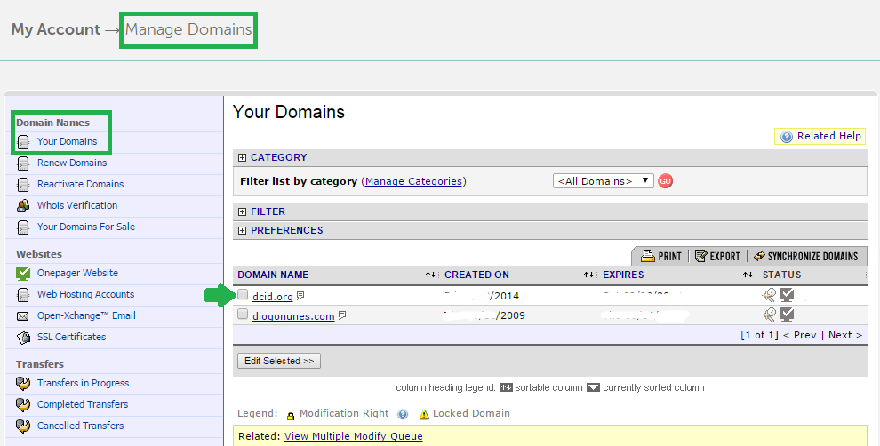
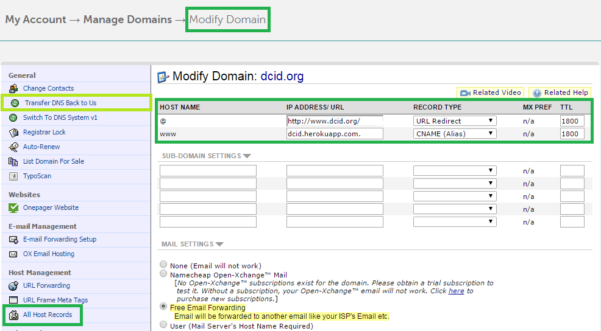
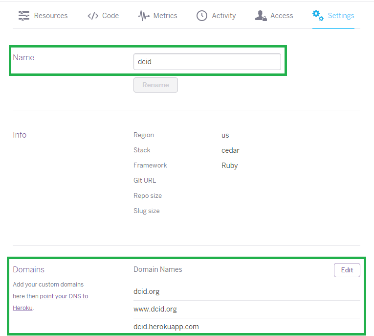

### Because no one will remember `gentle-tundra-5348.herokuapp.com`

If you deployed your Rails application to heroku for free, you probably ended up with an URL like `http://weird-name-1234.herokuapp.com/`. You can [rename that URL to something more familiar](https://devcenter.heroku.com/articles/renaming-apps), but it will always be of the form `*.heroku.com`. That's fine when your just testing or demonstrating your Rails app.

However when you're showing that application as a product to some potencial client, you might want to have your custom URL, like `www.awesome-product.com`. What would be really great was to have your own domain redirecting to your Rails application at Heroku. Well you can do just that and it's not hard, but there are some common pitfalls so I'll guide you through so you may avoid them.

First thing you need is to own that `awesome-products.com` domain. If you haven't bought it already, it's time to do so. A friend suggested me Namecheap back in 2009 and I've being using it ever since (thanks @Sanchaz). Their prices are fair and their service/support great. Go there and **buy the domain name you want**.

Now that you have the domain, you need to **redirect it to Heroku**. Analogy: if your Rails application is a house and your domain the house address, you're just changing your house's street address, the house stays in the same place (heroku's servers).

1. Go to **"Manage domains" » "Your domains"** and click over the domain you just bought (for me it was `dcid.org`).

**_Pitfall 1:_** Make sure you're using Namecheap's nameservers (DNS)! If you already owned the domain and were using another hoster's DNS servers, you need to click the "Transfer DNS back to us" option, otherwise you won't get access to the "All Host Records" option which will need in a second.

2) Go to **"Host Management" » "All Host Records"** and edit the first two fields. The **`@ field`** should have your full domain name and the **`www field`** should have the current url to your heroku app. Make sure you use **`URL Redirect`** for the first field and **`CNAME (Alias)`** for the second. In my case, I'm redirect any from `www.dcid.org` to the rails application at `dcid.herokuapp.com`.

3) Finally you need to add your new custom domain to Heroku. Open your application's dashboard and go to the **Settings** tab. On **Domains** add two entries, one for your `awesome-domain.com` and another with the `www.`, that way both URLs will resolve to your Heroku app.

And everything should be working now. If you type in <www.awesome-product.com> on the browser you should see your Heroku application. No?

**_Pitfall 2:_** When you try to access your domain you may notice you are redirected to `https` instead of `http`, and therefore you get an error message about a security certificate. Fear not, [the solution](http://stackoverflow.com/questions/13680768/running-apps-on-heroku-in-http-instead-of-https) is quite simple: in `environments/production.rb` there should be following configuration `config.force_ssl = true`. Just change it to `false` and redeploy.

Problems redeploying?

**_Pitfall 3:_** Remember when I suggested yo change your herokuapp's URL to something more familiar? Well, by doing that you may have confused your git repository. Again an [easy solution](http://stackoverflow.com/questions/7615807/renamed-heroku-app-from-website-now-its-not-found): `git remote rm heroku` followed by `git remote add heroku git@heroku.com:awesome-product.git`

And now you should be good to go. Optionaly you can [run a production check](https://blog.heroku.com/archives/2013/4/26/introducing_production_check) on Heroku to make sure everything is a-ok. If you have any more troubles please leave a comment bellow telling how you solved them.
