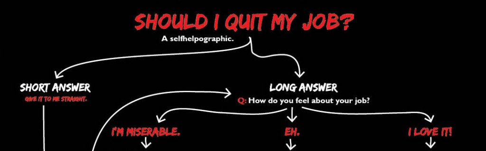

### Should you quit your job?

Well if you're asking yourself that question probably something is indeed wrong with your job. This infographic is a quick (and good-humored) way to assess if you should start looking for a better job. The guys at [JOBBOX](http://www.jobbox.io/) created a nice [survey](https://www.qzzr.co/quiz/are-you-happy-with-your-current-tech-job) customized for tech jobs.

> If you don't like something, change it. If you can't change it, change your attitude. Don't complain. M. Angelou

Maybe explaining your worries to your manager would improve your current situation? Maybe you just need a different team, or project, or set of responsibilities. Make sure you try pinpoint what the real problem is. This is a big decision, and you have to be confident about it.

### The decision

The [signs](https://www.linkedin.com/today/post/article/20140721130505-68335342-7-signs-it-is-time-to-quit-your-job) are all there... you're pretty sure you don't want this job anymore. Then it's time to tell it to your boss. This is a delicate situation and you should handle it great with (emotional) intelligence and professionalism. If you were doing your job right, this will hurt them more than you, so be prepared. Get ready for the [five stages of grief](http://en.wikipedia.org/wiki/K%C3%BCbler-Ross_model):

- **Denial** - They'll want to know why. And you'll tell them. Sincerely. They deserve it. Also, with today's technologies, they would have find out one way or the other, so tell them the truth and don't look like a traitor.
- **Bargain** \[optional\] - They'll try to keep you. They'll either match the job offer you got from the competition, or promise you improved conditions if you stay. Having second thoughts? You shouldn't. You didn't come here to ask for a raise. If you wanted that, you did it the wrong way. So stand firm, look him or her in the eye, thank the offer but refuse it.
- **Anger** \[optional\] - They'll threaten you. Just like with the "Bargain" stage, they will only happen according to your history in the company and the boss' personality. Your employer may argue that the company trusted you and made a huge investment in you. While that is true, it's even _truer_ that you're a free person and that a disgruntled employee is worst than no employee at all. Your boss will also add that your exit will imply lots of bureaucracy, and papers, and signatures. Indeed, what are we waiting for?
- **Depression** - They won't show you this phase.
- **Acceptance** - After 30 awkward minutes your boss will finally accept that you're quitting no matter what. And he or she will ask you one last thing: time. By law you ought to communicate your decision of quitting the company at least 30 days before effectively walking out the door for the last time. This gives your employer time to deal with the necessary legal stuff, find a substitute, transfer as much of your knowledge as possible, mitigate your exit's impact on ongoing projects, and craft a dark magic spell to forever curse your professional life (let's hope not!)

### The farewell

I use Chrome's [Momentum extension](https://chrome.google.com/webstore/detail/momentum/laookkfknpbbblfpciffpaejjkokdgca?hl=en), therefore everyday I read one random quote. I was presented with this quote on the day I told my boss I was quitting:

> Respect yourself enough to walk away from anything that no longer serves you, grows you, or makes you happy. Robert Tew

By all means, you want to make sure you're the first to tell _your_ decision to _your_ boss, on your _own_ words. You don't want a rumor to do that for you. Seriously, keep it a secret. Only after that you may tell about your decision to your family, friends, and colleagues.

It doesn't really matter if others support your decision or not; you're doing this for yourself, not for them. Invite your best colleagues for a night out, this shows you care about them and gives you an opportunity to explain why you left - therefore avoiding malicious ears and mouths around. Optionally you may think of a quote to yell while you walk the door in slow motion (this is optional too).

### The search

Ideally you'll quit your current job and start [your next job](http://www.linkedin.com/today/post/article/20140203202352-7668018-how-many-career-mistakes-are-too-many) the following Monday or sooner. I hope you didn't quit without having a better job offer or at least a plan to find or create your next job. If you did then you're reckless and you're taking unnecessary risks. In that case, you know the drill: look for job offers, search LinkedIn, send CVs, etc. etc.

If you're on the Information Technologies field, you're luckier than the rest, and the job will probably come to you. And now your friends can help too - introducing [JOBBOX](http://www.jobbox.io/). On their website they list [tech job offers from mostly startups](http://www.jobbox.io/offers) and you can sign up and apply to them. Optionally you may ask a friend to recommend you. If the job offer actually hires you, you get a job and your friend gets a money reward. It's a win-win-win.

Enjoy your new ~job~ life ;)
