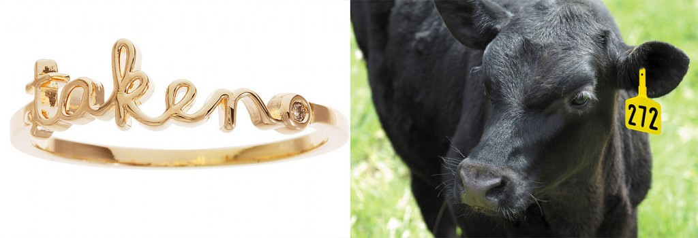

### Boy meets girl, boy loves girl, boy asks girl in marriage, girl expects a little box with a fancy ring.

You may not have been in that situation but we all know how it goes. That perverse tradition is wrong in so many ways, let me explain why.

### When did it all started?

[Egyptians](http://en.m.wikipedia.org/wiki/Engagement_ring#Ancient_times) were probably the first followed by the Greeks. But we're sure about the Romans: the bride would be given a golden ring to wear in public and an iron ring to wear when performing her duties at home. A different ring for different eyes, a clue that the ring was **not a token of love but merely an ostentatious object, showcasing the husband's wealth.**

### What's an engagement ring for?

That didn't change through time: to signal other males she's taken. That's why the girl wears the ring and the boy doesn't. After all he's free to look for someone else - the golden ring [was](http://en.m.wikipedia.org/wiki/Engagement_ring#Purchase) a source of financial security for the woman. Some guys even offer a ring right after they start dating the girl. The ring is a warning for **TAKEN: Look but don't touch**, much like how humans do with cattle.

### Why do they need to have a diamond?

You could as well ask [why Santa Claus wears white and red](http://www.coca-colacompany.com/holidays/the-true-history-of-the-modern-day-santa-claus), but in this case it's because [De Beers](http://en.wikipedia.org/wiki/De_Beers) wanted to. Who are they? A cartel that mines, trades and sell diamonds for a living. In 1930s they were selling less and less diamonds, so they created **a marketing campaign** persuading the consumer that an engagement ring is **indispensable**, and **the only acceptable stone** is - you guessed it - a diamond. Who cares about women's taste anyway?

### What the offering says about you

You know the [old saying](https://answers.yahoo.com/question/index?qid=20070524182411AAAFtBG): if the guy owns an expensive sporty car he's probably compensating _something_ else. Now picture this: you're on your knees, asking the girl you date and probably live with for quite some time, if she wants to marry you and spend the rest of her life with you. For sure she already thought about it, she already has the answer in her heart. And after you verbalize the question you show her a golden ring with a precious gem on top. On that moment **you're no longer offering yourself to her, you're making a trade.** Instead of

> accept me to love and cherish you like no one else

you're really saying

> accept me for all the material things I can give you, and since I'm afraid you'll refuse I'll offer this ring as an advance payment

### Conclusion

Seriously, **are you trying to buy her love?** That's what you're doing. Stop it! You're on your knees, you're giving yourself to her. She knows the person you are and the husband you'll be, that's enough. You still want to give her a token of your love. Fine, weak soul, buy her a dinner on that restaurant she loves, go on a vacation just the two of you, but please don't impress her with stuff. **If she doesn't understand that, walk away from the leech.**
