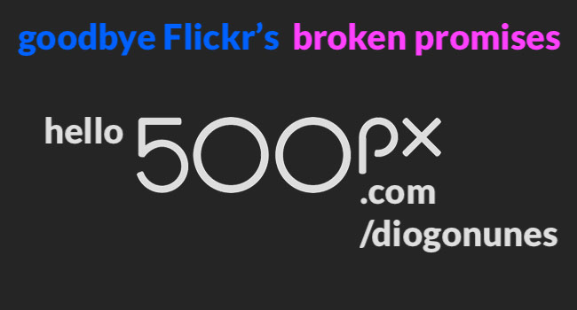
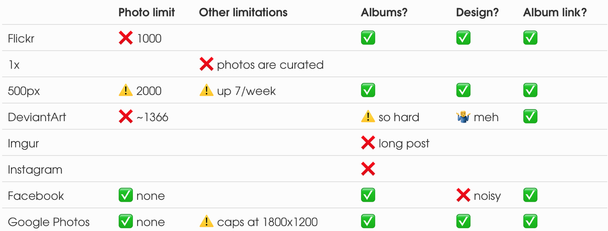

### Flickr broke my heart. It hurt but I've moved on.

The free tier of Flickr was reduced from 1TB of photos to [just 1000 photos](https://blog.flickr.net/en/2018/12/17/important-service-updates-and-dates-to-remember/). Flickr was my online portfolio solution for +5 years, but that move was a deal breaker for me. `#shame`

I started looking for another online portfolio platform. These were my requirements:

- **Must**: I can group my photos into albums
- I can share a link to an album with anyone outside the platform
- The design highlights the photos and has little distractions
- It can host at least 1000 photos for free
- _Optional:_ it has social features like votes and comments

Based on that criteria, this was my review of the 7 mainstream platforms:

### And the winner is...

> Store all photos on Google Photos
>
> Copy the best to 500px

**500px** won since it has everything I want for free: the design looks great, I can easily make and share albums, and it has social features built-in. The only downside is that I'm limited to 7 uploads a week, but there's no rush.

It's true that it has a photo limit unlike Facebook or Google Photos. Facebook was out because the design was very cluttered and mainly because I despise the company. So that's where **Google Photos** comes in, as a last resort backup or when during a conversation I want to show some photo (which was not good enough to go to 500px).

I've used this flow for several months and I'm quite happy with it ❤️

It's still free, it's easy to organise and share, and I end up with two backups online. The **caveat** is, I'm uploading the photos after they are edited and converted to JPG -- I still need some other reliable and cheat place to store my RAW/NEF originals. That will be covered on my next blog post.
