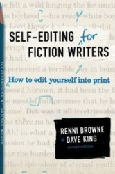

_This post is part of the ["From Dreaming to Publishing" series](/blog/?s=From+Dreaming+to+Publishing)_

- Ideally each character's dialogue is different, using different vocabularies and emotions
- Book's dialogue needs to be more to the point than real speech
- However it still needs to sound real, like something a person would actually say
- Characters should misunderstand each other, ask the other to repeat, disagree, lie, answer the unspoken questions, ignore the spoken, interrupt, make noises and react to gestures (body language)

## Checklist

- Read your dialogue out loud. Does it sound real?
- Does it sound too polished or formal?
- Any dialect? Or accent?

* * *

P.S: This post is a personal summary of a chapter from the book [Self-Editing for Fiction Writers](https://amzn.to/4xT1EaH), which I read when preparing for [NaNoWriMo](/blog/tips-writing-novel-for-nanowrimo/). It warns amateur writers for the common pitfalls and provides solutions with examples. I'm sure you'll find it useful too.
