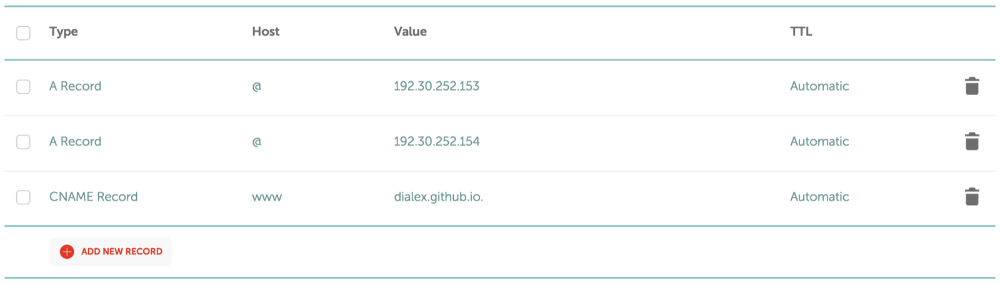

### No extra cost for using a custom domain.

To have a website online you need two things: a **domain** and a **host**. I'm assuming you already bought a cool and cheap domain on Namecheap (they're great). Now the only thing missing is a place to host your website.

**_$1 buys you an online presence for a whole year!_**

I wanted to publish a really simple landing page to test an idea. There are several companies that help you designing and hosting landing pages without any coding. They look free but **ALL of them will charge you to use a custom domain**.

Then I found GitHub Pages.

### ~Publish~ Push your static website to GitHub Pages

1. You know the drill: create repo, commit html/css/js files, push.
2. Visit your repository on GitHub.
3. Go to **Settings > GitHub Pages > Source**. Select the `master branch` option.

You should be able to view your site on a url like `username.github.io/repo`. That's not fancy. Let's change it to your awesome domain.

### Prepare GitHub Pages to use a custom domain

1. Create a file named `CNAME`. Add a single line with `domain.com`.
2. Commit and push.
3. Visit your repository on GitHub.
4. Go to **Settings > GitHub Pages > Custom domain**. Input your `domain.com`.

### Point your custom domain to GitHub's servers

[GitHub has an official guide](https://help.github.com/articles/setting-up-an-apex-domain/) to do this. Here's what worked for me:

1. Visit your domain provider (e.g. Namecheap).
2. Find the DNS settings (e.g. **Domains > Advanced DNS**).
3. Create two `A` records.
    1. For **Host** type `@` (that means root or baseline).
    2. For **Value** type the IP addresses you saw on GitHub's guide.
4. Create an additional `CNAME` record.
    1. For **Host** type `www`.
    2. For **Value** type `your-username.github.io.`. Mind the final dot.

### Leave in the oven for 30 minutes or 24 hours

With DNS I'm never really sure how much time to wait. The first time I tried it took one day to update. The next time it only took 15 minutes and a browser cache reset to start working.

Props to GitHub for having a service like Pages and their awesome support that really helped me get on the right track.
