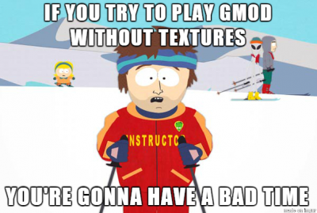
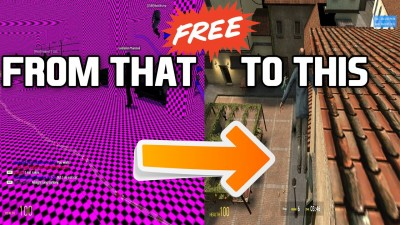
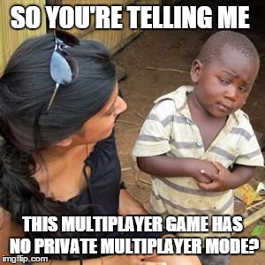
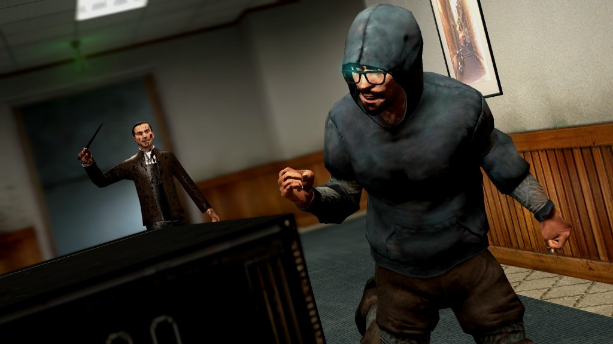
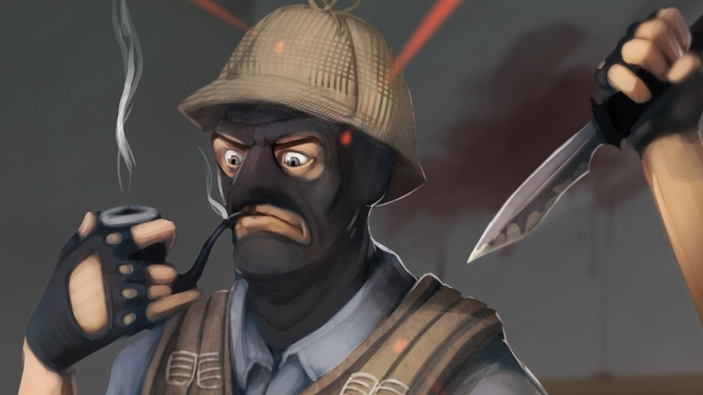
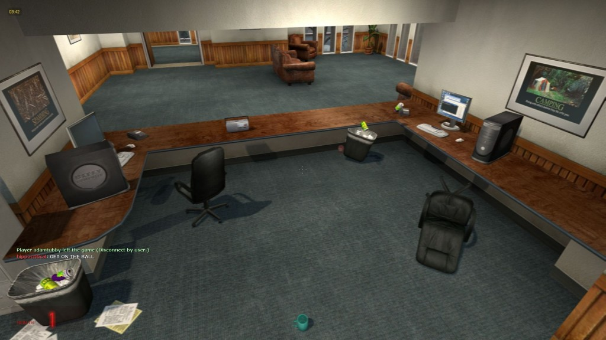

Garry's Mod (commonly abbreviated as gmod), is a sandbox physics game created by Garry Newman. It was originally a mod for Valve's Half-Life 2, but was later made into a standalone release in 2006. Currently it's a fun game to play with friends :)

⚠️ **EDIT: This guide was written in 2015 and is mostly outdated now** ⚠️

## Download gmod

The easiest way to get the game is buying it from the [Steam store](http://store.steampowered.com/app/4000/). The game usually costs 6,99€, however you can (and should) buy it during the Black Friday (November) or Winter (December) sale. You can [save up to 75%](http://store.steampowered.com/app/4000/), and get it with a discount for 1,74€.

You know the drill:

1.  Find the game on the [Steam store](http://store.steampowered.com/app/4000/).
2.  Buy it.
3.  Download/install it.

## Install Textures

He's right, if you try to play the game right away you'll have a bad time. If you join a multiplayer map you will most probably see the whole map covered on bright fuchsia/pink and black squares and `ERROR` messages (image below).

That's because the map requires textures not included in the standard installation. It seems that most gmod maps depend on a lot of Counter Strike textures, and for some weird reason they are not included in the installation.

**Solution:** you need to manually download and install all those textures.

1.  Download this [zip package](http://adf.ly/10475475/gmod-textures), which contains all the most used textures. Wait a few seconds, close the ad, and download the file (~700MB).
2.  Find gmod installation folder. It should be somewhere, inside Steam's folder. In my case, it was located at  
    `C:\Program Files (x86)\Steam\steamapps\common\GarrysMod\garrysmod\addons`
3.  Create a folder named `CSS Content Addon`.
4.  Extract the zip contents to the folder created in the previous step.
5.  Done. You should now have a `models`, `particles`, ... folders inside `CSS Content Addon`.

## Install Maps

At this time you could try join a multiplayer server, but chances are they are using a map you don't have. Sometimes gmod downloads that map and you play it just fine. Other times you get a `Missing map map/<mapname>` error message and you're kicked out of the server.

**Solution:** you need to manually download and install the most used maps (this is optional, but highly recommended).

1.  Download this [zip package](http://adf.ly/10475475/gmod-maps), which contains Counter Strike maps. Wait a few seconds, close the ad, and download the file (~100MB).
2.  Find gmod installation folder, again.
3.  From the **Install Textures** step, you should now have a folder named `CSS Content Addon`. Inside that folder, create another folder called `maps`.
4.  Extract the zip contents that `maps` folder.
5.  Done.

## Can I play with my friends already?

Yes... but only on public servers though.

We followed a dozen of tutorials and guides. We tried [Hamachi](https://steamcommunity.com/sharedfiles/filedetails/?id=144788474). We tried [Evolve](https://www.youtube.com/watch?v=le03I4Lhkl8). We tried disabling the firewall. We tried weird developer's console commands like `sv_lan 0`. We gave up after hours of trial and error.

We did not however try to play on a physical LAN -- i.e. play with computers connect to the same internet connection -- since we wanted to play from our own home. Feel free to try any of the above. If you find a solution let us know in the comment section below.

**Workaround:** find a public server with few players on it and tell all your friends to join it.

## This game seems broken...

And when you try to enter a public multiplayer server you will probably have to wait a few minutes before being able to play. That's because public servers have a multitude of player models (skins) and addons, and your local client has to download all that crap before you're able to play.

Make sure **Options** > **Multiplayer** > **Download Custom Content** is set to _Allow All Custom Files From Server_. That way all the files you ever download are stored locally on your game's folder, which means faster loading times the next time you join that or another public server.

For more error and problem solving tips check this [post](http://gaming.stackexchange.com/a/113556).

Sure, the game seems broken and unpolished... but it has so many game modes and they are so freaking funny to play!

## Most popular (and my favorite) gmod game modes

### Murder

There's a murder on the loose with a knife and no one know who he or she is. And his/her sole objective is to kill everyone!

If you are a "bystander" you must run around collecting items with a green glow around them. Collect 5 items and you will get a gun. The gun is a one hit kill but you only get one bullet before you reload. One person will spawn as a bystander with a gun. Everyone else will have to find items to get them.

If you are the "murderer" you must kill all the bystanders. You have a knife that is a 1 hit kill. You can collect green items as well but you wont get a gun. Instead you may change name and thus hide your identity and confuse the remaining bystanders.

### Terror in Terrorist Town

The game is about a group of "terrorists" who have traitors among them, out to kill everyone who's not a traitor. A small number of players is selected as Traitors, who have to kill all the Innocent players (ie. the rest of the players). Those innocents know they are in the majority, but they do not know who is Traitor and who is not.

The Traitors must use the element of surprise and their special equipment, if they are to succeed. The Innocent just have to survive, which means finding out who the Traitors are and killing them before they kill you. Of course everyone is holding a big gun, and everyone looks suspicious...

For the Innocent, knowledge is power: who is acting strangely? Who can be linked to evidence found on corpses? Who is still alive, even? Hello, is anyone there?

### Prop Hunt

You know props, those objects that decorate maps: chairs, tables, plants, fridges, pans, food cans, etc. In this game mode half of the players can transform into any of those props and the other half must find them and kill them.

It's your job as a prop to hide as well as possible and look as inanimate as possible. Sure, you can start running like crazy, but a moving chair is clearly asking for shotgun shot in the back :P

## Have fun!
