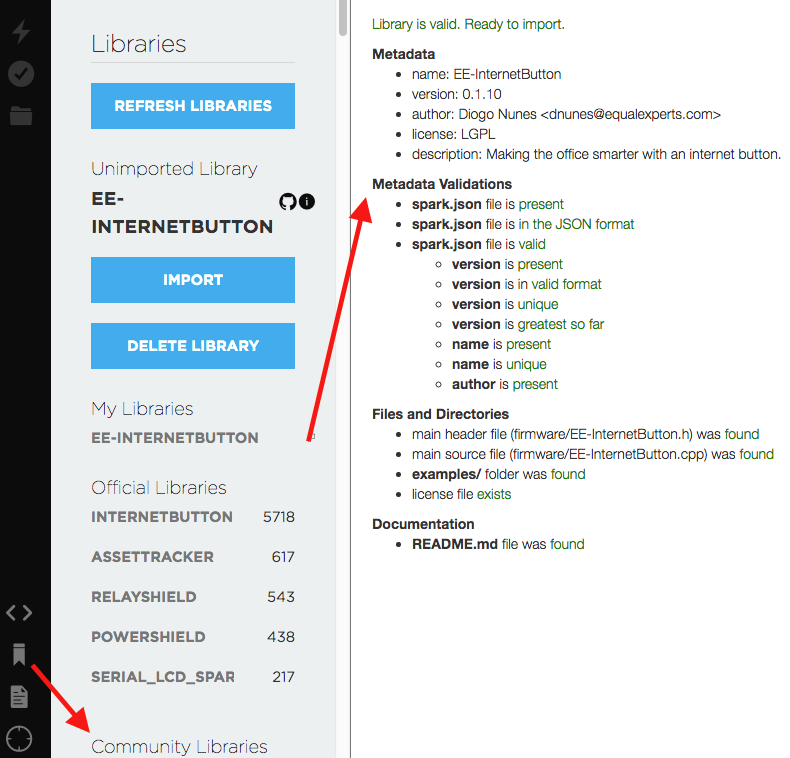
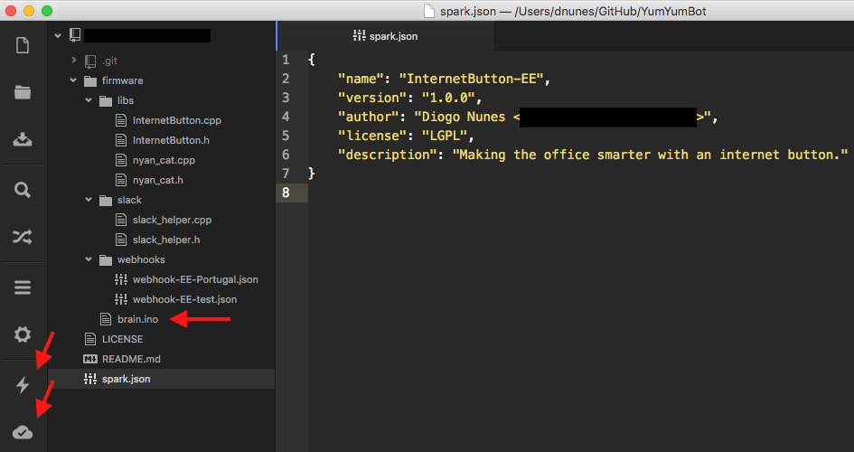

## First things first.

Now that you can [connect to your Photon](/blog/internet-button-unboxing-first-steps), it's time to give it some intelligence - time to get coding! To manage that code let's create a git repo.

## GitHub

The official documentation recommends that you fork their [InternetButton](https://github.com/spark/InternetButton) repo. You don't have to, but it helps to follow their repo structure.

Here's what I recommend you do:

1. Download their repo as a zip. [Unzip it](https://youtu.be/D8K90hX4PrE?t=20s).
2. Keep the folder structure.
3. That `spark.json` is mandatory. Customize it according to your project.
    - Keep in mind that your project's name must be unique
    - Version should follow the format X.Y.Z (and can't go backward!)
4. Leave untouched the `InternetButton` C++ files, you'll need those.
5. Delete the `Examples` folder.
6. Commit. Push. Your repo should be public for now. After you connect it to your Particle's account you can make it private.

## Web IDE

Take a deep breath -- you're about to enter the depths of hell. This is where I started but I would avoid it if I could. You can try to skip this step and go directly to the Local IDE section below.

1. Go to [build.particle.io](https://build.particle.io) and create an account. Login.
2. Click the **Devices** icon, in the lower left corner. Make sure your device is listed there.
3. Click the **Libraries** icon. Scroll to Community Libraries and search for the name of your repo (that's why it needed to be public). Then click **Include in app**.
4. From what I recall, that should connect your GitHub with your Particle. There was a lot of trial and error, click and cross fingers involved.

DISCLAIMER: **Forget their web IDE.** Period. It's too complicated, nothing makes sense, the UI is not intuitive, the files and libraries management is a nightmare. Kill it with fire. Carry on.

## Local IDE (Particle Dev)

This is their web IDE but ~done right~ better. It's a custom version of [Atom text editor](https://atom.io/). This is the one place to go to develop and deploy code for your Internet Button.

- The **Compile** button, sends you code to Particle's cloud and compiles it. If you get and error it will tell you the file and line (but you can't jump to the source code...).
- The **Publish** button, starts by compiling your code and then deploys it on your connected device (displayed on the footer). Your Internet Button's should start blinking when this happens.

Your main code should be inside a `*.ino` file. That file should contain at least two methods: `begin()` and a `loop()`. Now is the time to looks at the examples at the [InternetButton](https://github.com/spark/InternetButton) repo. We'll go through some of them on the next part of this tutorial.
