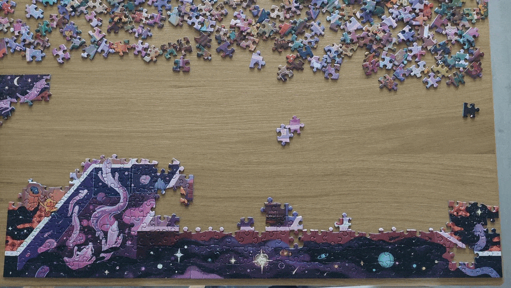
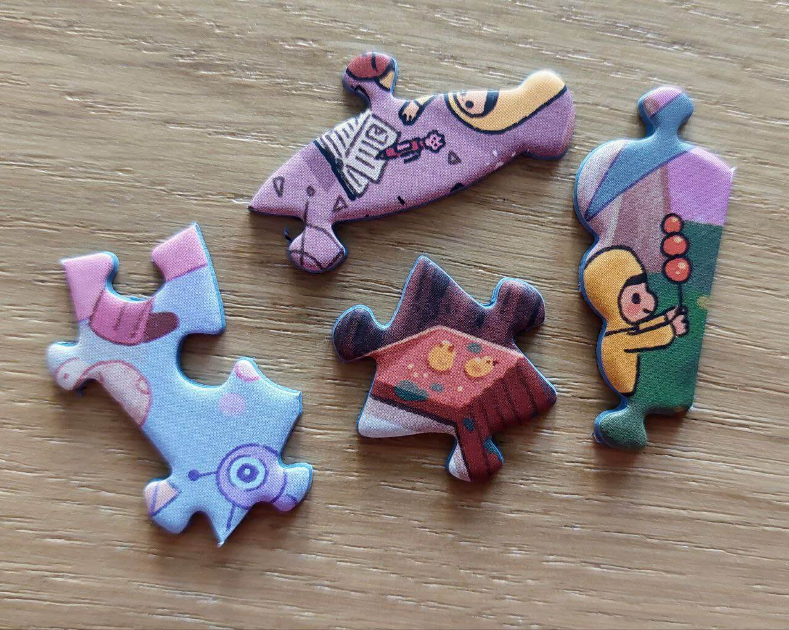
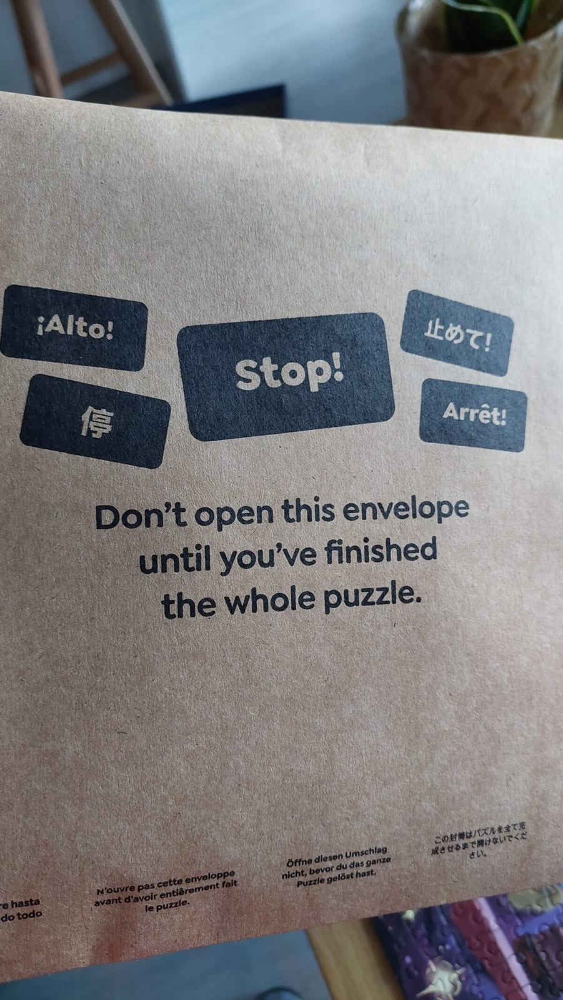

In my childhood, I often saw puzzles in stores - the classics, featuring images of animals or cityscapes, composed of 500 or 1000 pieces. One time I was even offered one, but I never found the interest to unwrap it – it looked so boring. Little did I know that my opinion of puzzles would completely flip in my adulthood. Let me introduce you to a true gem.

## Finding the puzzle

Fast forward a couple of decades, and I'm scrolling through Kickstarter in search of fresh boardgames. That's when I stumble upon ["The Magic Puzzle Company"](https://www.kickstarter.com/projects/magicpuzzlecompany/magic-puzzles), the artwork of their puzzles immediately grabs my attention. I dive into their campaign and I realise – these are the best puzzles I've ever seen. The attention to detail and craftsmanship is top-notch. I was new to Kickstarter at the time, I so ended up not backing the project

One year later, the holiday season is getting closer, and I'm thinking of something to keep me entertained, and guess what springs to mind? Yep, that magical puzzle from Kickstarter. Their campaign was successul and now they are on Amazon US. I place my order, and then I wait for the puzzle to cross over the Atlantic.

Finally, it arrives! Let me tell you about the box: the print quality, that shiny finish... it's a visual treat. I proudly display it on my KALLAX shelf, nested among my board games. But then, I spot it. A hole in the box. "Feels bad man." No way was I going to settle for a box with a hole

I message Amazon and, after more weeks of back and forth, a fresh one arrives. Anxiously, I open the package and give the box a thorough review. Perfection. What a relief! A week later, I'm clearing my table, and starting this challenge.

## Doing the puzzle

Everything feels premium. The exterior box, the sturdy cardboard envelope that cradles the pieces, sealed neatly with a strip of velcro - a design that promises endless replays without a hint of wear. The attention to detail is everywhere, and that's something I deeply value.

As I read the instructions, I stumble upon a sneaky free sticker, disguised in plain sight. It's as if the puzzle and its creators are winking at you with each interaction, always throwing in a playful twist

Every day, I would dedicate at least an hour to tackling this puzzle. My naive strategy? Starting with the edges, assuming they'd be an giveaway with their straight lines. Turns out, this puzzle has pieces with edges that are not at the edge of the puzzle! The first of many curve balls that this puzzle throws at you.

Speaking of the pieces, I'm baffled by their unique shapes. As a puzzle newbie, I expected the pieces to be squarelike. Not this puzzle. Not only do the pieces ensure the characters stay in frame, but sometimes they themselves take on shapes that mirror the characters within. So, a piece featuring a pen? Shaped like a pen. A segment with a worm? It curves just like a worm. It's amazing.

I experimented with various strategies - seeking out patterns, focusing on colors, or a particular shape. The inclusion of a photo of the finished puzzle is a brilliant touch, serving as a handy reference during assembly. With every step of progress, as I scrutinize each piece, I find myself enjoying the artwork's intricate beauty. And once the puzzle is complete, the artwork unfolds in its entirety, like a panoramic view from the mountain peak after two weeks of trekking, revealing every little detail of the path I've traversed.

## "The Magic Puzzle"

I won't spoil it. I'll just say two words: freaking amazing. Magical indeed.

This is yet another instance of the "nod to the player" that I mentioned before.

## The gift that keeps on giving

And when you think you're done, the puzzle pulls another _"but wait, there's more!"_ moment.

Now that you've pieced together this entire masterpiece, it's time for a ["Where's Wally?"](https://en.wikipedia.org/wiki/Where%27s_Wally%3F) challenge. You are given a list of things to spot in the puzzle's art, like "find the three snails". Surprisingly, it's not as hard as it sounds. After all, you've spent weeks immersed in this puzzle, you've seen every piece. Sometimes, you'll know exactly where something is. Other times, you'll spot things you'd previously overlooked, despite countless glances. Another sprinkle of magic

Let me sidetrack a bit with something personal. Switching off my brain is no small feat for me. My monkey mind is always thinking or worrying about something. I've tried coloring books as a form of relaxation. It gives me even more stress! The pressure to choose the right combination colors is nerve-wracking. It ends up taking away from the very relaxation coloring it is supposed to offer.

But puzzles? There's only one solution, and I don't influence the end result. That means I can focus on a single thing, finding the right piece. I was truly immersed, reaching that state of flow – time, worries, and even hunger fade away. It's like a long deep breath for the mind.

## Verdict

I loved it. Now, granted, it's the first and only puzzle I've done, so I might be a bit biased, but I genuinely believe there's no puzzle out there as good as the puzzles from this [Magic Puzzle Company](https://amzn.to/3SkxBqm):

1. **Premium quality**: The quality of components, pieces, box, everything is top quality.
2. **Attention to detail**: It's the little things, the surprises, the free sticker, the shapes of the pieces, the mindful framing of artwork in those pieces, the reference image (actually they give you two, so that you and a friend can assemble the puzzle together).
3. **Beautiful artwork**: I went with ["The Mystic Maze" by Boya Sun](https://amzn.to/40fpvB3)... I mean, just look at it! The art style, those vibrant colors - it's a treat for the eyes.
4. **Endless surprises**: When you think you're done, there's more, and then some.
5. **Relaxation**: This puzzle gave me that same serene state of mind that meditation promises. It held my focus and gave my brain a much-needed breather.

As for downsides? Well, truth be told, I'm struggling to find any. The price feels more than fair for the experience and quality you're getting. If I had to nitpick, the company boasts about no puzzle dust. I'm not sure what the standard is, but I did find a bit of dust. Nothing major, just meant I had to give the table a little blow every now and then to clear it away.

In a word, this puzzle is **amazing**.

It's a resounding "yes" for anyone seeking a fulfilling, immersive activity, for kids and adults alike. So far they have released three series, offering a grand total of nine puzzles to pick from. Whether you're into vibrant hues like those in ["The Forest Feast"](https://amzn.to/49clHEK), or prefer something more subtle like ["The Secret Soup"](https://amzn.to/3FAUU7z), they've got something for every taste.

[Go ahead, have a look](https://amzn.to/3tS9iFW).

For us grown-ups, I found it a better experience than coloring books. It demands your complete attention and rewards you with a tangible, stunning result. No worring over color choices or feeling constrained by your artistic skills – just pure mechanical work and keen observation.

> _Disclosure: This is NOT a paid review and I did NOT receive the item for free. The purchase and review of this product were made voluntarily._
