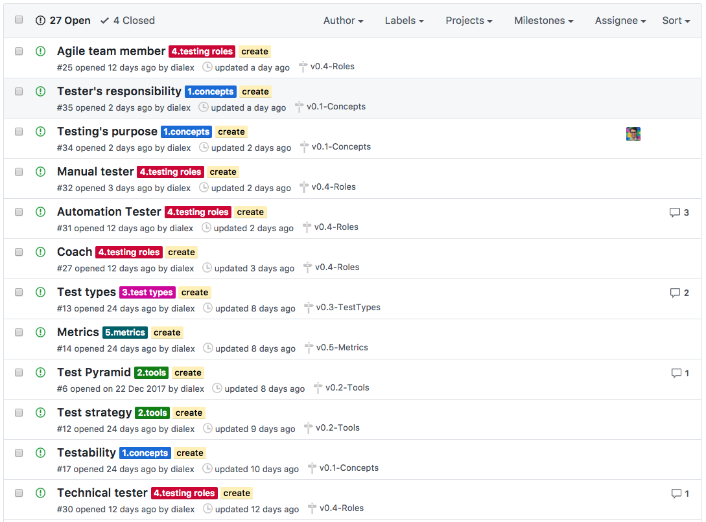
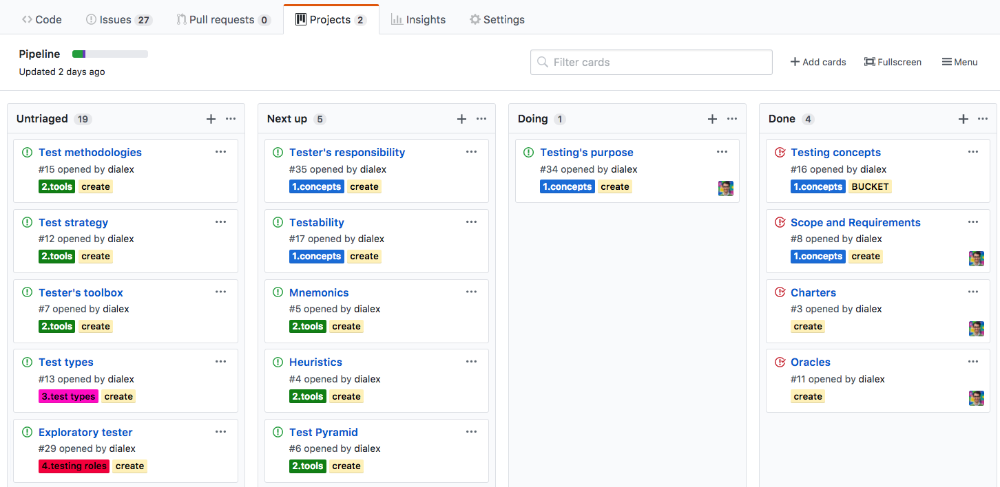
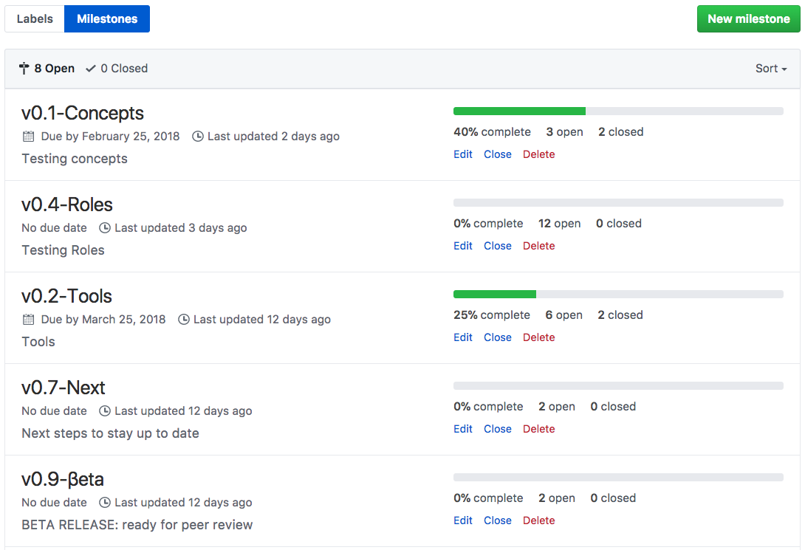
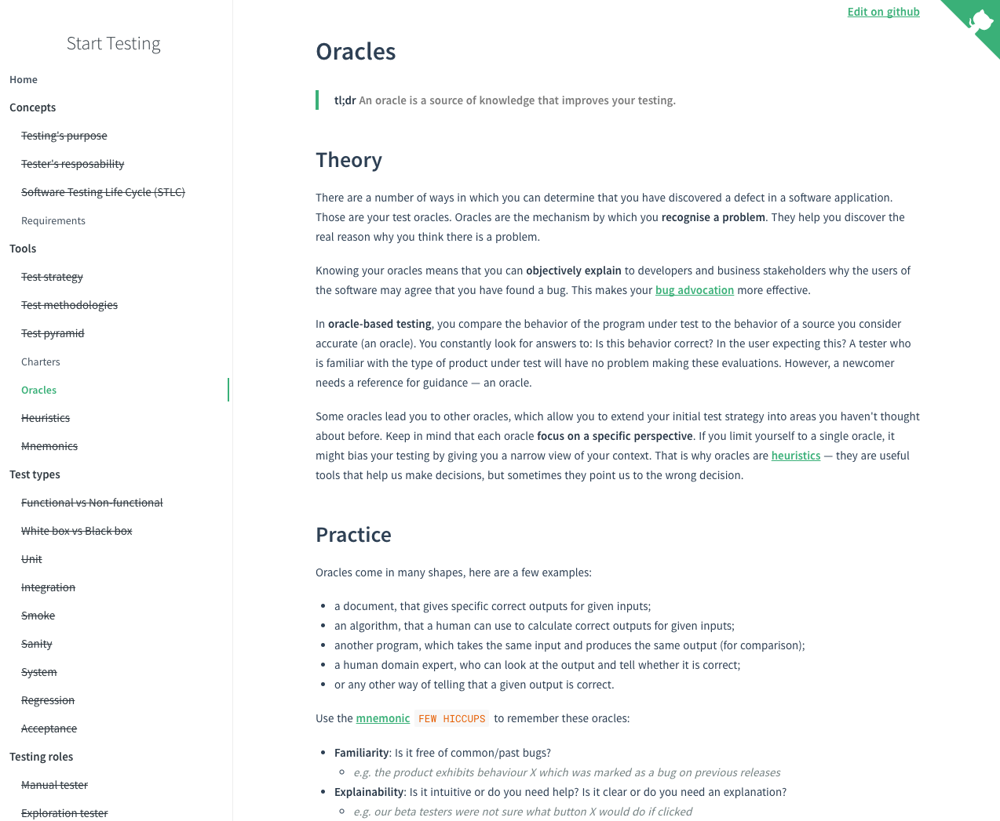

### Using GitHub & Agile to manage a hobby.

I learned all I know about testing on the job. **That's not enough for me.** That's why I have a strong desire to do a deep dive on testing — take my time and revisit the fundamentals, learn "the proper way" to test, and mentally connect all the concepts I found along the way.

> Teaching is one of the best ways to learn.

I could do a testing course... indeed, I could ~do~ create one! During these years I gathered dozens of blogs, books, tutorials, talks about testing. **So what if...**

- I read all that and wrote summaries?
- and published those summaries to help others?
- and anyone could make changes to keep them updated and unbiased?
- and all this was built and managed through GitHub? `#NerdLife`

Thus [Start Testing](https://github.com/dialex/start-testing) was born on Jan 1st.

The topics I need to investigate are GitHub issues. They contain the links I need to read.

I prioritise those topics with a simplified Kanban.

I group topics into milestones, which allow me to track my progress.

When I push changes, my ~code~ article is automatically checked for spelling mistakes. `#CI` If it passes the test, it goes live! `#CD` The rendered [Markdown](http://commonmark.org/) looks like [this](https://dialex.github.io/start-testing/#/)

Let's see where this journey takes me!
