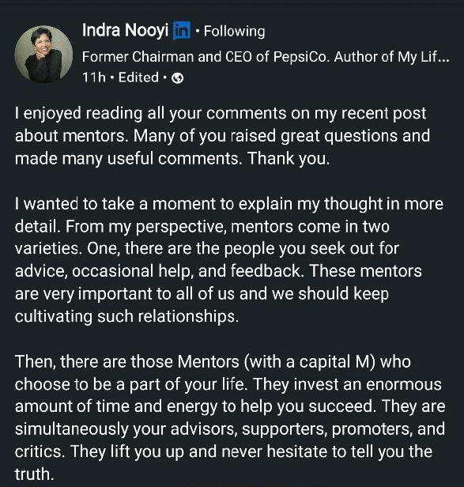
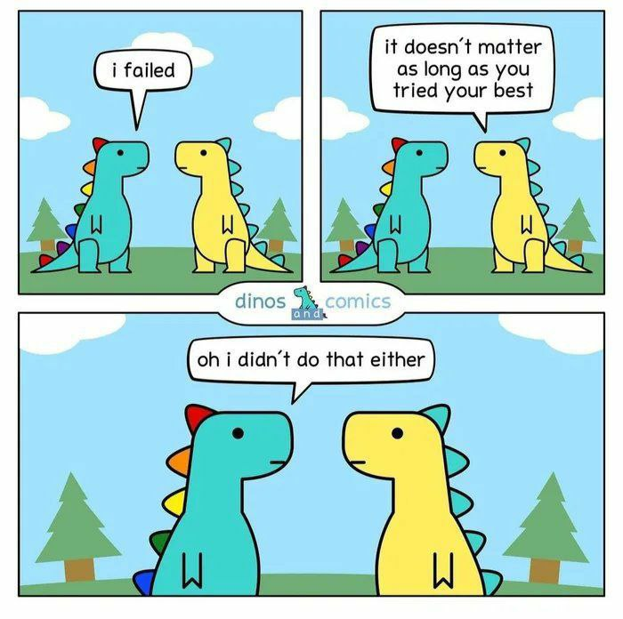
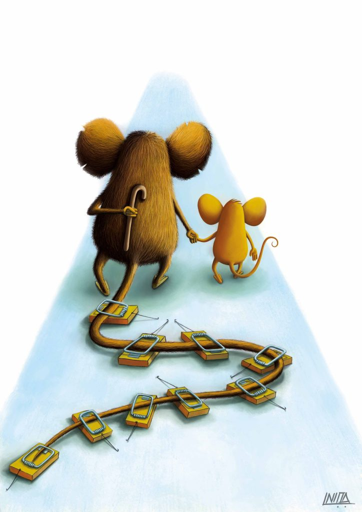

Doing volunteer work brings me joy and fulfilment. My first event as a volunteer was in 2015 and I've been doing it ever since (if possible, multiples times a year). I only wish I started it sooner. One day I'll write about it.

Today I want to tell you about one type of volunteer work: **mentoring**.

## Mentoring students ‍

It started when I was at college. I was in my first year of my master's degree when I started mentoring first years.

I had 8 students under my wing, straight out of high school. My role was to be someone that was available for them, someone to clarify any doubt or share my college experience. After all, I was a student like them, just a couple of years ahead.

I never did the work for them, but I was always one message away from helping them.

In my opinion, the only way for mentees to grow is for them to try, struggle, and finally ask for help. If I offer advice without the struggle part, they will not understand the value or relevance of that advice.

> Let's use a gym analogy. As a mentor, I must not lift their weight. What I can do is teach them the right pose, so that their effort maximizes their gains, without injuries. I can also gently lift the weight the first couple of repetitions, so that later I can just stand back and they will be strong enough to continue by themselves.
>
> I also shouldn't go on a monologue and tell them about every tip and pitfall. That's too much theory without context. By the time they need that information, they already forgot it. When they struggle, that's the perfect time to give just enough information and in context.

When I finished my Master's I left college and started working. But I still wanted to keep helping those students. So I created a website [estudarinformatica.info](https://estudarinformatica.info/) (roughly translates to "studycomputers.info") with my tips and experiences.

For each college subject I would answer questions like "How difficult is it? How much hours do I need to put in? What topics are covered? Should I buy a book?". All this using a casual language that any student would understand and relate with. I even uploaded the handwritten notes I created to study for exams!

I also had a public inbox, so anyone could email me their specific questions. I helped ~50 students (and sometimes their parents!). I met two of them IRL (in real life) and we became friends.

## Mentoring colleagues ‍

Almost 10 years after I finished college, during one random day at work, a colleague sends me a message. We're not in the same team, so there's not much to chat about. But we have some things in common, we're both QAs and she actually interviewed me when I applied for that job. She asked: "Hey, do you mind being my mentor?"

I was surprised. I should be the one asking that, since I was the "new guy" at the company. I didn't know how I could be of any assistance... but I said yes. And I'm so glad I did.

### Mentoring as a manager ‍

At first I was stressed. "I'm not mentoring a student anymore, I'm at work, I need to do this properly" I thought. I searched online how I should do it.

> **Long-term goals help define short-term priorities.** For instance, knowing what you want to achieve in three years helps guide your goals for this year. And, in turn, knowing what you want to achieve by the end of the year gives you a robust framework to put in place your agenda for the next quarter, the one after that, and so on. Priorities are not to-do lists, they are supposed to be short and a guiding light. – Paraphrased from [source](https://hkbusinesscoach.com/productivity-at-work/)

Soon I stumbled upon S.M.A.R.T goals:

> S – specific, significant, stretching
>
> M – measurable, meaningful, motivational
>
> A – agreed upon, achievable, action-oriented
>
> R – realistic, relevant, rewarding, results-oriented
>
> T – timely, tangible, trackable

I even found a [checklist for "first meeting with your mentee"](https://blog.mentorloop.com/first-meeting-with-your-mentee-a-checklist-e4ce2e9ee888)!

**To be honest, I never used any of that.** The more I tried to use the tools above to shape or guide our bi-weekly 60 mins call, the more it felt like I was becoming her manager. She already had one, she didn't need another. She needed a mentor. And I needed a friend. We both got what we wanted.

### Mentoring as a friend

> "A mentor is someone who sees more talent and ability within you, than you see in yourself, and helps bring it out of you" – Someone

I know some companies have a "buddy system" where an employee that is at the company for longer will help a new joiner. From my experience, I speak once with my buddy, on the first week of the job, and then we go our separate ways.

Other companies assign you a mentor randomly. A person who works on web development might end up mentoring someone from mobile dev. Or maybe the personalities won't match, like an extroverted/confident person mentoring an introverted/shy person. It's just as bad as an arranged marriage.

In our case, our match was natural and voluntary. I relaxed and went with the approach that was more natural to me – "this is just a call where two colleagues talk about problems from work and share their experiences and advices".

## What I learned as a mentor

- Mentoring another colleague from work is a chance to see a glimpse of how different people work. Not only it builds relationships and bridges between teams, but it also inspires the pair to try each other's techniques.

- If you are a manager, you can advocate for the idea of colleagues mentoring each other, but you should not make it mandatory or assign pairs.

- The pair agrees how the mentoring sessions should work. You don't need structure or formality for it to work. Let it flow and evolve naturally.

- **Sometimes people don't need a teacher. They just need someone to be vulnerable with.** They just need a space where they can try-fail-recover without judgement.

- Like with any other volunteer work, don't expect anything back, the reward is doing it.

- That [BTS](https://www.youtube.com/watch?v=WMweEpGlu_U) are actually good!

## Evolution

I was very lucky. My mentee just needed that space/person where she could ask any question and do any mistake without feeling she would be shamed or penalised. I was more her therapist than her teacher. She had the will to get better, she had the skills inside her, she had the curiosity to seek more, she only lacked one thing: confidence in herself.

She would constantly undermine her actions and undersell her achievements. The way she talked about herself sounded like she was talking about a stranger she wasn't fond of. It's like she was trying to run a marathon with her shoelaces tied together. She wanted to run, and she could run, but she kept tripping on her self-sabotage. Since the foundation was all there, that's what I tried to improve in her.

### ‍♀️

One of the best rewards I got was seeing my colleague grow. I guess this is the same feeling parents get every time their kids get stronger and more mature.

When we started, my colleague was too shy to screen share her code with me. Nowadays she writes automated tests by herself and when she's stuck she's not afraid to ask for help from her teammates. She uses a test framework she picked not because she was comfortable with but because she wanted to try something popular and modern. She doesn't wait for SRE to give her a pipeline that runs her tests, she creates that pipeline herself!

### ‍

When I close my eyes to remember the moments we had – the struggles, the victories, the evolution – they always drop a tear when I open them, and that tear is full of emotions: the **joy** of seeing someone dear win at life, the **pride** of knowing I had a little part in it, the **fulfilment** of having a positive impact in the world, the **nostalgia** of the past, and so much more that words can't describe but the heart can feel.

Thank you S. for letting me walk beside you
