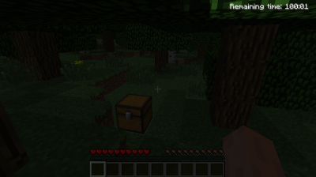
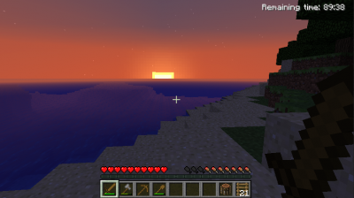
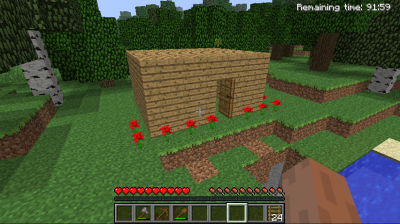
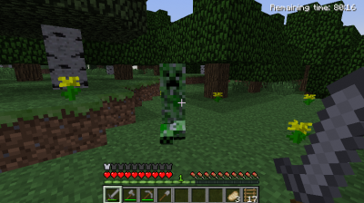
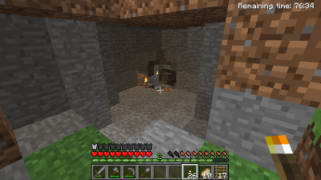
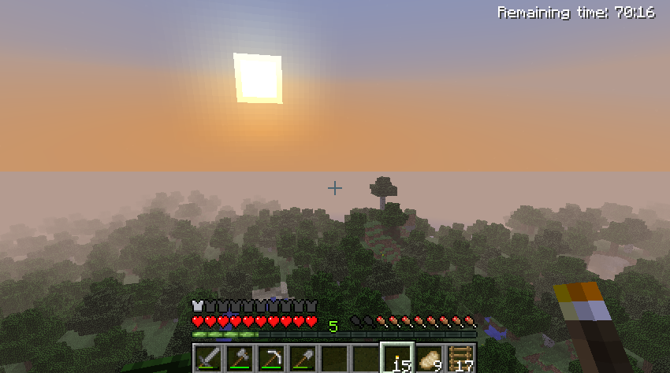
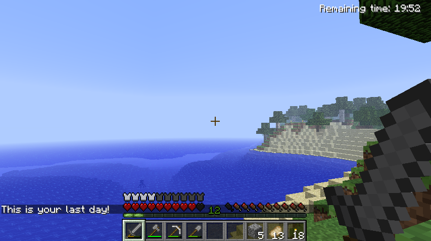

### A month ago, I had a strong [emotional breakdown](http://youtu.be/G_Z3lmidmrY). Yesterday, I was missing playing Minecraft.

The last time I played it (almost 6 months from that) I made a promise not to play it ever again, mainly because without self-control it becomes a time sink. The game has no specific objective and is based on adventure, so you always have something to do or try.

Yesterday, [I heard one of the songs](http://youtu.be/z-jh2ZcS3H8) that compose the game's soundtrack and I felt an urge to play the game again - by the way, you should [listen the whole album](http://c418.bandcamp.com/album/minecraft-volume-alpha) because most of the songs are adorable.

I decided to play the free demo, available at the official website - yes, you can play it for free right on a browser! The demo is like the full game _but_ with limited playing time (100 minutes). After playing it for almost an hour I had an epiphany: **Minecraft's demo is a metaphor of life itself.** Only now, due to the thoughts and feelings that my breakdown brought, I could notice it.

_The clock is ticking_

When you start the game you are told that you have a limited time to play it. You have no rules, no purpose, no friends; it's just you and a giant world. You start exploring and you notice plants, animals, water, clouds and a big luminous sun. You also notice that on the upper right corner there's a countdown; that is **the time you have left on that world**. That's the only rule, when the time runs out you die. No matter where you are, what you're doing, what you've accomplished, what you built... it ends.

Wow.

Knowing that changes your whole perspective about the world. What's your purpose? How are you going to spend your time? In the full game you aren't limited by time, therefore people build gigantic constructions using complex machinery and others collect and craft all kinds of objects. They do all this ultimately to show it off. Why would you build stuff and collect stuff if you know it will all be gone after the clock stops? Is this adventure about you or the others?

I decided to explore the world. It seems to me the most reasonable and fulfilling choice. I may have limited time but I'll enjoy every minute, I'll feel the adrenaline of exploring, I'll discover the diversity of this world... I'll live!

I observed my first sunset and it was beautiful. I made myself a wooden sword, but that won't help much in a fight. I built a simple house: four wooden walls, a door, no floor, no roof, no bed. I don't need more, I just needed shelter from the zombies, the spiders and the creepers outside.

Yes, there are things outside that want to hurt you and stop your clock immediately. Zombies and spiders make a lot of noise when following you, so you have plenty of time to prepare yourself. Creepers on the other hand are _silent and deadly_. They crawl behind you and literally explode. The last thing you hear is the sound of an explosive's burning fuse. Can you notice the metaphor? _(Tip: accidents, diseases, etc.)_

I found a cave in a mountain. Obviously I entered since I was looking for adventure and mystery. It was pitch dark. I mined just enough coal and crafted just enough torches to lighten my way. I found more tunnels but sometimes I needed to mine my way through the mountain. I saw bats and fought spiders and skeletons. I reached a dead end, but then I heard sheeps. That's right: sheeps under the mountain! I started [diggin' a hole](http://youtu.be/fR7EAdPUqvQ), but this time upwards! After mining a few blocks of rock, I found dirt and finally grass. I had made it to the top of the mountain. And by my side, a purple sheep. Thank you for your guiding "baaaahs", purple sheep.

Later on, the game remembered me: **"This is your last day!"** What an intriguing thing to hear. Would I like to know my countdown? Would I like to have someone warn me, "good morning dear, just to let you know that this is your last day"? I really don't know. Now that my time is running out, I'm thankful that I didn't waste it building a [giant red dragon](http://youtu.be/s0jsVJZI8YI?t=1m8s) or a [replica of Lord of the Rings' Minas Tirith](http://youtu.be/CjuN8sEfBxc?t=55s), block by block.

**And the time ran out.** It wasn't a game over -- I could not win and I certainly did not lose, it just ended and I couldn't insert more coins. That world, my avatar, my modest house, my stuff, were all gone. And now I was in another world, another person, another house, other stuff. Will there be another world after this? I don't know but I hope so. What time I have left in this world? I don't know, but I hope [it's adventure time!](http://youtu.be/2cmAuKS1ZRE)

### Conclusion

Minecraft is _just_ a game, and I played just a _demo_ of it. It's amazing how [a modest (indie) game](http://youtu.be/t0eqSgkDuW0 "The creation and evolution of Minecraft") can model so closely life itself. The game really is just blocks interacting with each other. Yet again, life is just atoms and energy interactions. That's the beauty of this metaphor.

Focus on living experiences and not on collecting stuff. Stuff is left behind but experiences are part of you. Remember, **_you can't see it but the clock is ticking..._ 🥲**
