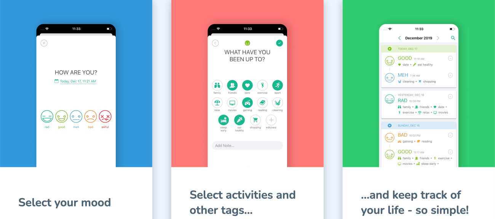
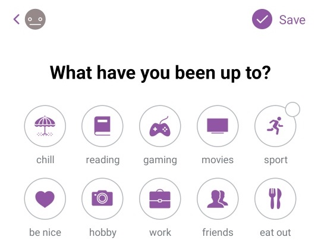
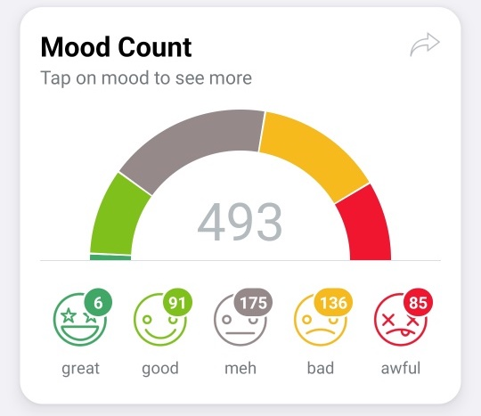
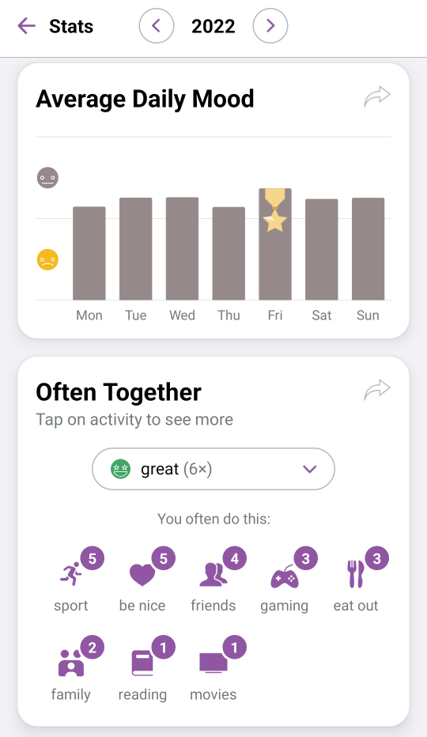
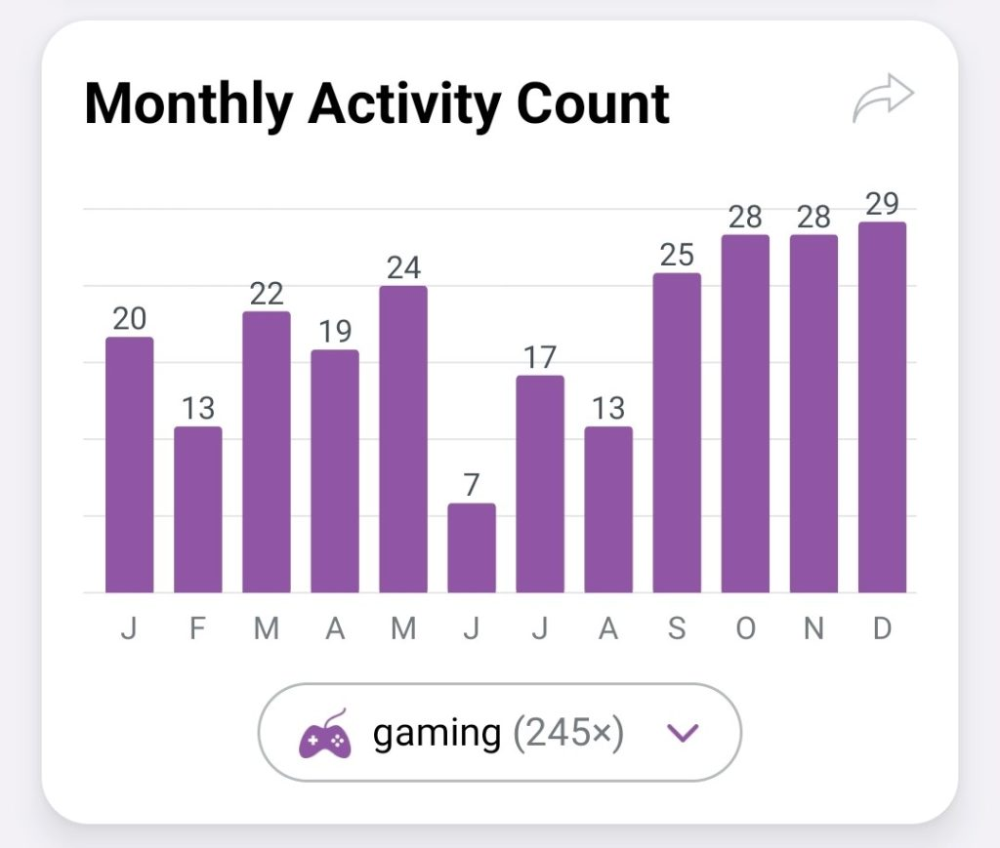
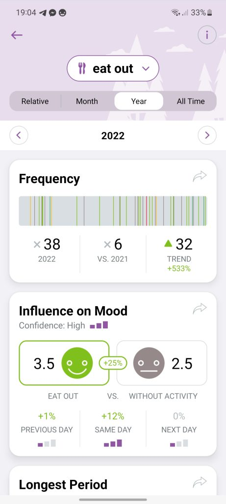
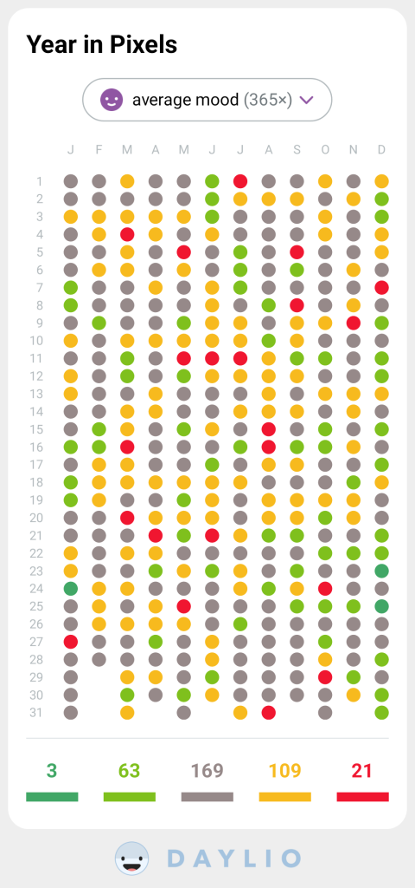

### How to easily track your mood and learn more about your emotions

In 2018 I hit rock bottom. I was struggling with frustration, rage, and sadness.

There's a technique called mood journaling which is very useful to discover what triggers certain emotions in you. Every day you record your emotions and what made you feel that way. You do this over several weeks and then look for patterns and trends.

If you put the effort to be detailed you will be rewarded with better, more accurate insights. All you need is a notebook or an app, plus discipline.

That's how I found the [Daylio app](https://daylio.net/ "‌"). I've been using the app every day since February 2018, so you can do the math to know how many times I've used the app. It's probably the oldest and most consistent habit I have in my life.

The default configuration of the app is pretty good. Once you get used to it I suggest you tweak it to make it yours – the moods, the activities, the colours – it needs to fit your reality. Personally, I have

- A range of 5 emotions (awful, bad, meh, good, great)
- A list of 15 activities (e.g. gaming, reading, eat out, etc.)

Every day, before going to bed I open the app and with a handful of clicks I select how I felt overall and which activities I did during the day. This takes less than one minute. On bad days it feels kinda cathartic.

This is my method. Find your balance between _convenience_ and _precision_. If you go for convenience, take note of how you felt in general and which events made you feel that way. If you go for precision, you write down how each particular event made you feel.

> **Convenience** example: Today, no particular event had a strong emotional influence in me. In general, I felt good, so I'll grade it as “good” and list the activities that I've done (work, exercise, read book).
>
> **Precision** example: The day had a bad start, due to a horrible nightmare. I went out to take some photos, but nothing special happened. In the evening I watched a hilarious movie. So I'll add three lines for today, one with "awful" for the event "nightmare," another line with "meh" for "hobby," and finally "great" for "movie".

Here's why I like this app so much:

- I don't forget to journal, because every day I get one notification. I set the time to 9pm
- If, somehow, I forget a day, it breaks my daily streak and there's no way I'll let that happen!
- It takes me less than 60 seconds and 6 clicks to journal a day
- Everything is customisable: activities, moods, icons and colours
- Patterns and insights are calculated automatically: mood counts like “you felt great X times,” activity counts like “you had nightmares X times,” “your happiest day of the week is X,” “when you feel awful it's often due to X”.
- The insights are grouped by month, year or activity and they are displayed in beautiful and intuitive charts.
- Your data never leaves your device (optionally, you can use your Google Drive for backups)
- All this is free

With this data I was able to figure out what lifts me up (e.g., playing games with friends) and what drags me down (e.g., family drama). Find yours.

Here are some examples:

I hope the examples above showcase the usefulness of this habit/app.

> _Note: This post was not sponsored. This is an honest and unbiased review._
