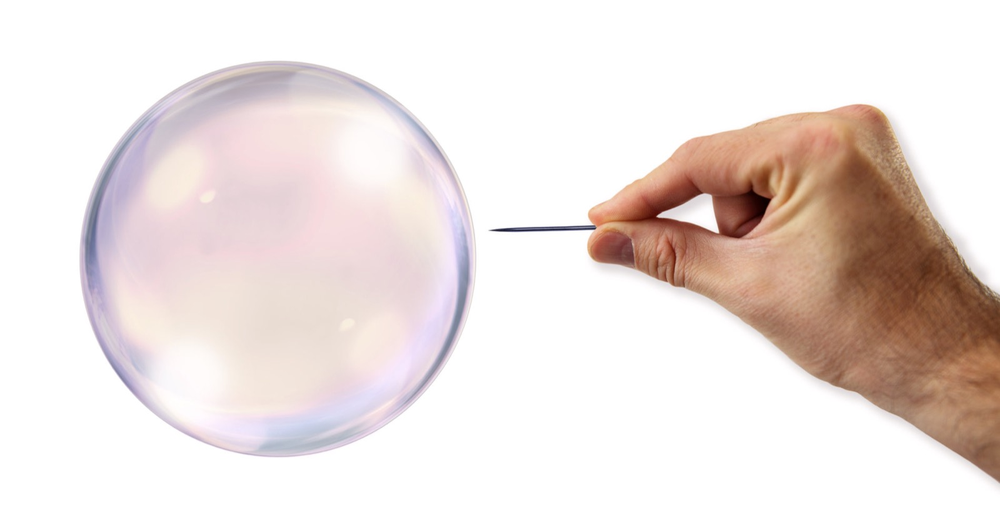

## Parents, I'll take a vacation... from you

I'm an introvert. Life is great inside my personal bubble. But I know the magic happens outside the comfort zone. So once in a while I challenge myself. This time I decided to leave my parents' house and live on my own for at least one month.

> It's scientifically proven that dishes and clothes have one thing in common — they do not wash themselves.

After [I changed jobs](https://pt.linkedin.com/in/nunesdiogo), I was spending once again about 3 hours a day on commuting. Do you recall my previous post ["Get Efficient, Get Together"](/blog/get-together-get-efficient/)? Work, gym, shops and services, all were _together_... except home.

It took a month and dozens of renting websites to find the room I was looking for. It's exhausting **finding the balance** between:

- **Location**
- **Price**
- **Quality**
- **Amenities & Furniture**
- **Number of roommates**
- **Room vs Apartment**

And this is the time you'll hate being a guy -- yup, some listings just refuse to accept male guests. Now I know how gender discrimination feels like.

> So you're telling me that when I get home -- besides worrying about cooking my dinner -- I have to check the pH of the fishes' water?

Oh, and some houses include pets. Apparently those owners prefer to outsource that responsibility to strangers. I saw descriptions like "includes sociable Labrador", "family cat", or even "fish tank"! It's amazing how people transform disadvantages into marvellous features of the house.

**Anyway, I'm living the dream again.**

## But it started as a nightmare.

I couldn't sleep on my first night, too much anxiety. During my childhood my room became my safehold and an extension of my personality. Having that removed and replaced by a little room, in a random place, with random people around... was like placing my personal bubble over a bed of nails. And I reckon this is a "first world problem", that makes me look like a spoiled kid. Still, it hurts.

> When you take a vaccine you're exposing your body to a small and controlled dose of illness. It hurts at the time, and you may even cry. However, in the long term you will be more resilient.

This will probably **happen to you**:

- Discover that dishes and clothes do not wash themselves.
- Be even more grateful for the _backstage work_ your parents do for you.
- After a certain hour, your brain starts thinking in the background "what will I cook for dinner? And HOW?"
- You eat less, but you savour each mouthful. After all, it's your work.
- Even an expert in tech freezes when he/she uses a washing machine for the first time.

## tl;dr

- Challenge yourself out of the comfort zone.
- "Bite your tongue", embrace it and endure it.
- Those achievements will strengthen your confidence.

When did you moved out of your parent's house? How was it?
