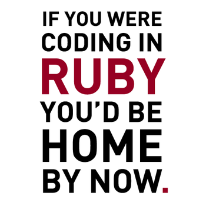

### This post is a review of those three frameworks considering four criteria: Ease of learning, Speed of development, Tools/Plugins, and Community.

Right from the start I banished PHP from my possible choices. I know that _"sufficiently talented coders can write great applications in terrible languages"_ ([Jeff Atwood](http://blog.codinghorror.com/php-sucks-but-it-doesnt-matter/)), but I just don't like PHP, probably because of its syntax, and [I'm not the only one](http://www.reddit.com/r/PHP/comments/1fy71s/why_do_so_many_developers_hate_php/). You can find a lot of \_\_\_\_ vs PHP comparisons online, and you'll see that the _challenger_ always win - except for [legacy](http://www.leonardteo.com/2012/07/ruby-on-rails-vs-php-the-good-the-bad/) reasons. And the main challengers I'm talking about are JavaScript (Node.JS), Ruby (Rails), Python (Django) and Java (Play).

My objective was to create a platform similar to [StackOverflow](http://stackoverflow.com/). Although everyone suggested me to go with Rails, I chose Django. Our relationship lasted [four sad months](https://github.com/dialex/dcid_django/commits/master) and I _broke up_ before finishing the prototype. So I moved to Play Framework and achieved the same functionality in [two months](https://github.com/dialex/dcid_play/commits/master) with less frustration. Finally I switched to Rails and implemented all that and much more, finishing the prototype in less than half that time - [22 days](https://github.com/dialex/dcid). Looks like _everyone_ was right in the first place.

This post is a review of those three frameworks considering four criteria: **Ease of learning** (programming language, documentation, tutorials), **Speed of development** (programming productivity), **Tools & Plugins**, and **Community**.

### Django

Django uses Python, known for its [simplicity and indentation rules](http://en.wikipedia.org/wiki/Python_syntax_and_semantics), which makes it a good language for programming beginners. The [Zen of Python](http://legacy.python.org/dev/peps/pep-0020/) advises that _"there should be one, and preferably only one, obvious way to do it"_ and it should be well [documented](http://stackoverflow.com/questions/7103500/learning-web-development-django-vs-node-vs-rails-vs-others/7104442#7104442). Since my [Q&A website](http://www.osqa.net/) just required the basic functionality of every dynamic website - create user, authenticate, post question, make comment, cast vote - I guessed there would be plenty tutorials explaining how to implement the basics using the one right way. **The [official documentation](https://docs.djangoproject.com/en/) exists but it won't be enough if you're a beginner** at dynamic web development. Sometimes **it assumes you know** something and skips an explanation that would help you understand the big picture. Doing [Codecademy's python course](https://www.codecademy.com/catalog/language/python) also helped me get a grasp on Python's syntax and semantics but that's like learning the abc. You might want to watch [these video tutorials](https://www.youtube.com/playlist?list=PLxxA5z-8B2xk4szCgFmgonNcCboyNneMD).

**I installed Django on Windows: bad move.** It was a long and painful process, requiring multiple small tweaks to silence the errors. I sure hope the process is a lot smoother on Linux. After having a hard time installing and configuring Python + Django + WAMP + Aptana Studio (IDE) I was ready to code. I followed Django's official tutorial (v1.4 at that time), a [walkthrough](http://wiht.link/django_primer) to create a _"site that lets people view polls and vote"_ which suited my initial goal after some customization.

Django uses [MTV (Model, Template, View)](http://www.djangobook.com/en/2.0/chapter05.html#the-mtv-or-mvc-development-pattern) instead of [MVC (Model, View, Controller)](http://en.wikipedia.org/wiki/Model%E2%80%93view%E2%80%93controller), so `Django's Templates == everyone else's Views` and `Django's Views == everyone else's Controllers`. Your main application is composed of modules; actually your app is also a module. So you create your app, you give it an innovative name `Contoso`, and then you're forced to create a module - where the actual code will be placed - but with a different name. _Sigh_. Instead of `ContosoForReal` let's call it `ContosoMainModule`. **After you look at Django's folder structure you start to get anxious.** Your `Contoso` app folder only stores the url routing file (`urls.py`) and the global settings (`settings.py`); Your `ContosoMainModule` folder contains the models (`models.py`), the controllers (`views.py`), yet another url routing file (`urls.py`), and a folder named `templatetags`. So where would you put the templates? In the same folder next to the model and the controllers? `templatetags` is a good candidate for that. Nop, they'll be placed outside `ContosoMainModule`, side-by-side with your app folder `Contoso` at `templates\ContosoMainModule`, [see for yourself](https://github.com/dialex/dcid_django). _Sigh_.

Indentation is a big thing for Python, in fact your code won't compile if your code isn't properly formatted. If you didn't know you'll find out pretty soon, after you start getting compile errors with cryptic error messages. Time to turn on the whitespace highlighter and search for that naughty tab or space (just don't mix tabs with spaces!). _Sigh_. **The whole time it looks like you're fighting a battle with the framework**, to see who controls who. You have to specify everything to the last detail; seriously I had to search [how to auto-increment an Id primary key](http://stackoverflow.com/a/11965793/675577), why isn't that a default?

The only tool I used for Django was an IDE and it didn't help me much. I used Aptana Studio which is basically an Eclipse _distribution_ optimized for web technologies. Although Aptana is great for HTML/CSS/PHP, its Django support is weak: **no syntax highlight** for Django-specific files (only Python) and the **auto-complete rarely completes anything**. When you're still discovering the framework and its API, an auto-complete would be a precious help. _Sigh_.

Thankfully, **the community exists, both on StackOverflow and Google Plus**, and is there to help you. All my questions and doubts were always answered in time. In one year Django went from 1.4 to 1.7, thus the core development team is pretty active. Also there are plenty of modules (plugins) for your applications available online, but some are more plug'n'play than others. There were so many authentication modules I couldn't choose which one to use. I tried to use a voting plugin. I ended up creating my own. _There should be one obvious way to do it_. _Sigh_.

**tl;dr** developing on Django is an exhausting symphony of sighs.  
\- ★★★☆☆ Ease of learning  
\- ★★☆☆☆ Speed of development  
\- ★★★☆☆ Tools & plugins  
\- ★★★★☆ Community

### Play

But wait, **why should I learn Python+Django from scratch when I could leverage on my Java skills and use them for webdev?** So Play Framework came to the rescue. Right away, I removed the effort of learning a new programming language. Besides I always enjoyed programming on Java. The quantity of [official documentation](http://www.playframework.com/documentation) was similar to Django's (ok maybe less) but it was more comprehensive and dummy-proof. "[Zentasks](http://www.playframework.com/documentation/2.3.x/JavaGuide1)" is a tutorial that guides you on the process of creating a website for task management. It's so much better than Django's approach: here **you start the tutorial with a clear tangible goal**; content is presented incrementally and logically; and plenty information and examples are provided on what you need to do and why.

The [environment installation](/blog/installing-play-framework-2-1-on-windows/) was so **much easier** (on Windows): JDK + Play + Eclipse + Config `%JAVA_PATH%`. _Simple_. My typical workflow was opening two command lines (one that automatically compiles the project after each change and another that acts as a local webserver), change the code on Eclipse, refresh the page on the browser. _Simple_, no more "how do I do \_\_\_ on Python...", just think and code it. The [folder structure](https://github.com/dialex/dcid_play/) makes a lot **more sense**: an `app` folder with a separate folder for `models`, `controllers` and `views`; a `public` folder for static content; a `conf` for configurations and `evolutions` for database migration files; a `test` folder for tests. _Simple_.

**Play's template system to avoid boilerplate is really useful and it looks a lot like inheritance.** Each [template](https://github.com/dialex/dcid_play/blob/master/app/views/base.scala.html) may receive inputs and define "blocks"; those [inputs](https://github.com/dialex/dcid_play/blob/master/app/views/baseSite.scala.html) are used to fill the dynamic parts of the template (like the user's name); and those [blocks](https://github.com/dialex/dcid_play/blob/master/app/views/index.scala.html) can be `implemented` or `overrided` by other templates that `extend` the original template. _Simple_, powerful, and _coherent_ since you're using Java/OOP concepts across the framework. The only problem I faced was ManyToOne and OneToMany relationships. I was trying to code a tag system, where I could get from a Tag all tagged questions and from a Question all of its Tags, so `One Question` has `Many Tags` and `One Tag` has `Many Questions`. I [never](http://stackoverflow.com/questions/16286700/manytomany-relation-with-play-framework-1-2-5-jpa) managed to make it [work](http://stackoverflow.com/questions/18298173/how-to-populate-a-manytomany-relationship-using-yaml-on-play-framework-2-1-x) like I wanted.

Developing Play or Java on Eclipse is great, the syntax highlighting and auto-complete just works. You also have access to all those Eclipse plugins that make your life easier (github integration, checkstyle, findbugs, etc.) Having the possibility to develop **JUnit tests** is also handy, and _coherent_ once again, but I didn't really had the time to create them.

**I tried once to deploy** my Play application on Cloudbees and **it wasn't straightforward**. The problem had something to do with a configuration, since my app was using a local database and I had to create another rule for the remote database. Cloudbees' support helped me a lot but before we could fix the issue I moved to Rails. Have a loom on how you can [deploy your app](http://www.playframework.com/documentation/2.4.x/Production)

**tl;dr** perfect if you know Java and want to develop web applications, it just works.  
\- ★★★★★ Ease of learning  
\- ★★★★☆ Speed of development  
\- ★★★☆☆ Tools & plugins  
\- ★★★☆☆ Community

### Rails

There are so many great places to start learning Ruby and Rails. **99% of what you'll ever need is documented online by the community**; I only visited the official docs to check specific the signature of specific methods. First, you should do the quick course [Try Ruby](http://tryruby.org/levels/1/challenges/0), then get a [Ruby/Rails development environment](/blog/set-up-your-rails-env/), and finally follow every step of [The Ruby on Rails Tutorial](http://www.railstutorial.org/book) by Michael Hartl. You also have [screencasts](http://railscasts.com/) available. Ruby has a very natural and concise syntax, so if you're a programmer used to highly verbose languages (e.g. Java) you'll take a while to get used to it.

**Rails development is blazing fast**. Most of this development speed is achieved through auto-generated code that does make some (fair) assumptions. For instance, if you create a \`User\` model it assumes you'll need an auto-incremented \`ID\` to identify each \`User\`, and Rails takes care of it for you. Model relationships are as easy as `User has_many :questions`. _Not bad_. I pretty much followed Michael's tutorial from end-to-end, since it covered almost everything I needed for my project, so I never really got stuck. And **coding tests** is the best, **it's like plain English**:

```
describe "after saving the user" do
  before { click_button submit }
  let(:user) { User.find_by(email: 'alice@wonderland.com') }

  it { should have_link('Exit') }
  it { should have_title(user.name) }
  it { should have_selector('div.alert.alert-success') }
end
```

_Not bad at all!_ And **the template system is even better than Play's**. They have the notion of `partials` which is just a block of reusable code. So on Play I had to inherit a base template and implement every empty block - hence, the "baggage" of the base template always came attached. Rails uses composition: for example you define a partial that receives a `Question` ID and displays the voting buttons for that specific `Question`. Anytime you need to display voting buttons for a question, just `<%= render vote_buttons_question, :id => 123` anywhere your code. And partials than call other partials. Do you want to change the buttons' color? Just change the partial! [_Nice!_](http://youtu.be/WVDfAthF6sA?t=13m2s)

At that time **I had given up on IDEs**. Michael advised to use Sublime Text and I wanted to learn more about Sublime, so I sticked with it. I lost auto-completion but I gained coding performance, like Sublime's quick find (Ctrl+P) that saves you from navigating through the folders to open a file just by typing the file's name. And you can't place breakpoints to debug your code, I really miss that feature. So sometimes I had to [paste my Ruby code online and run it](http://repl.it/languages/Ruby), debugging it via command line. A really handy tool.

And **gems just work** the way a plugin should work. I needed a voting system: `gem 'thumbs_up'` + `Question acts_as_voteable` + `User acts_as_voter` = done. I needed to encode emails to prevent spam: `gem 'actionview-encoded_mail_to'`. App monitoring? `gem 'newrelic_rpm'` Font Awesome? `gem 'font-awesome-rails'`. Deploy? After the initial configuration it's as easy as `git push heroku master; heroku run rake db:migrate`.

This is **the power that comes from an active open-source community**: somewhere in time, someone had your problem, solved it, and provided a solution for everyone else. Again, find them at Google+, StackOverflow, and on local meetups.

**tl;dr** Rails enables fast development great for prototyping. The more you use it the more you love it.  
\- ★★★★☆ Ease of learning  
\- ★★★★★ Speed of development  
\- ★★★★☆ Tools & plugins  
\- ★★★★☆ Community

### And the winner is...



Any questions?
