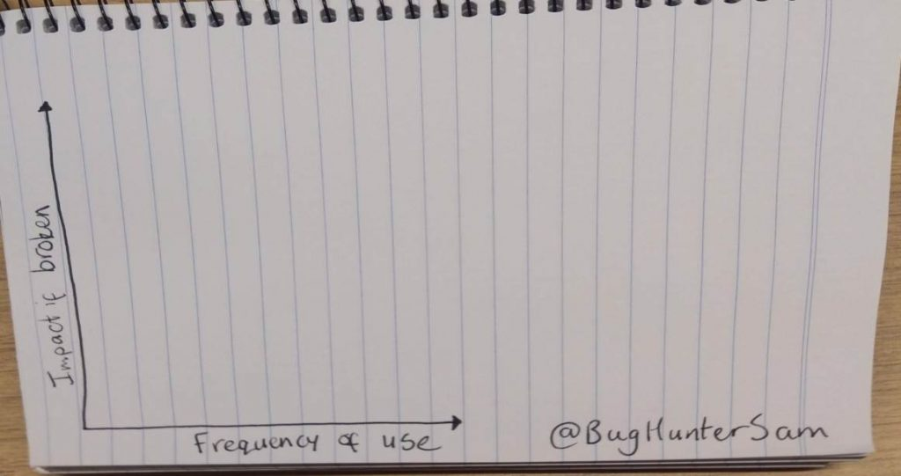
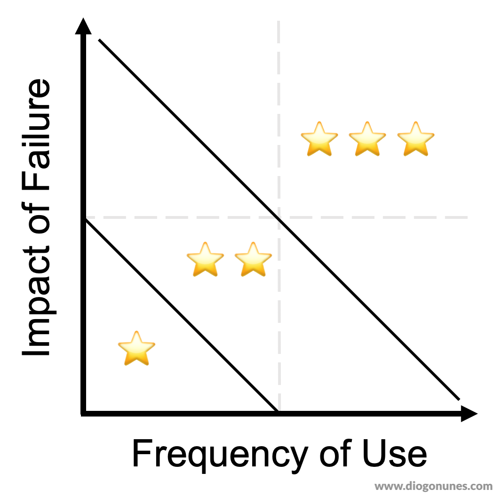
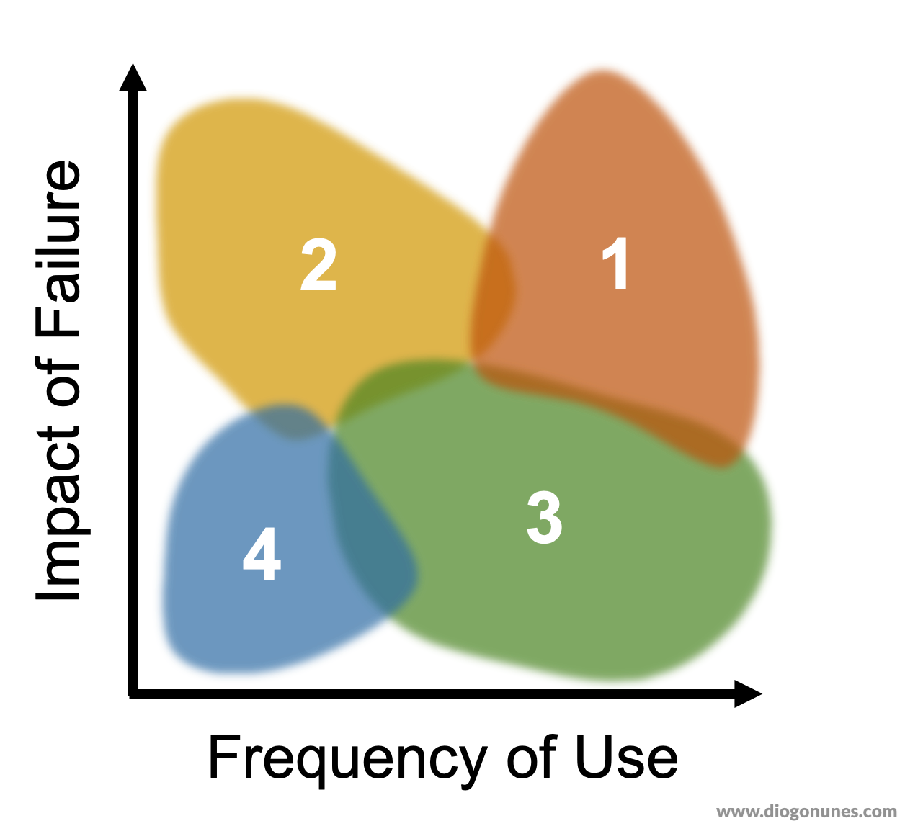
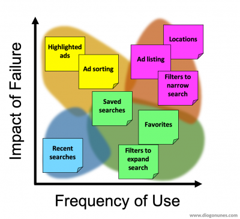
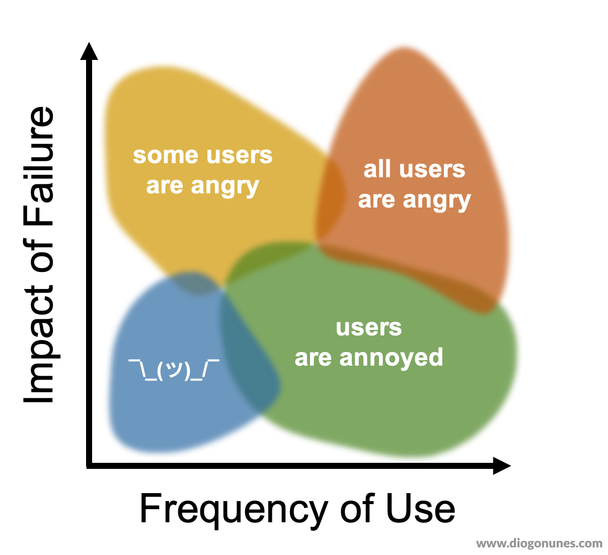

> Scenario: My team wanted to write more automated checks, but we had too many features to cover and not enough time. We had to prioritize what to test... but how to do it objectively?

[Sam Connelly](https://twitter.com/BugHunterSam) wrote an article about [Visual Risk](https://bughuntersam.com/visual-risk-ui-automation-framework/). The exercise visually maps features in terms of frequency of use and impact of failure.



The exercise goes like this:

1. Draw a simple risk heat map (just the axis)
2. List your flows or features on post-its
3. Place your post-its into the risk map
4. Let the group discuss the previous placement (and iterate)

When you finish the exercise you have a visual prioritisation of features, in terms of risk or importance. That gives you an idea on what to test.

I found his exercise very hands-on and insightful – exactly what I needed.

### Goal

The goal was to let the team prioritize which areas should be covered by automation next. We included _product_ because they knew how important each feature was. And we included _developers_ because they knew which code areas lacked confidence.

### Concerns

As you can see from Sam's hand-drawn graph, you can place your post-its freely. That's why the group discussion is so important: it allows the frequency and impact of each feature to be peer-reviewed, reducing the placement subjectiveness.





When placing your post-it you could mentally divide the chart into three slices or four quadrants. I preferred the quadrants view. My intuition said the "zone" would be more important than the exact placement.

### Constraints

Our product and engineering team was over 40 people, located in different offices and timezones. So we had to adapt Sam's co-located exercise to be remote friendly.

- Participants would choose from a list of features, _instead of writing their own_
- Participants would fill a form, _instead of moving a post-its on a board_
- Provide a scoring framework, _instead of debating the location of post-its_

Our scoring framework looked like this:

```
This is an estimate, go with your intuition. Some areas might overlap.

1 -  Critical   |  HIGH usage  HIGH impact  |  "fix it now" - hurts business
2 -  Important  |  LOW usage   HIGH impact  |  "fix it today" - hurts pro users or legal req
3 -  Annoyance  |  HIGH usage  LOW impact   |  "fix it tomorrow" - hurts user experience
4 - ‍♂️            |  LOW usage   LOW impact   |  "add to backlog"
```

### Steps

1. With the help of product, make a list of 10 features
2. Create an online form
    1. Introduce the goal and the instructions
    2. Explain the scoring using an image
    3. One feature per row
    4. One column per score (1-4)
3. Share the form with your product/engineering team

### Results



Given our constraints, we were able to extract substancial value from this exercise without the effort of a co-located workshop. The exercise fulfilled its purpose and we got our prioritisation.

### ✅ Conclusions




From my analysis, I understood that:

- The "three slices" are more flexible but less accurate, so they work better on contexts with uncertainty or audiences that score based on emotion/intuition.
- The "four quadrants" are less subjective but more coercive, so they work better with analytical audiences or contexts with more data and clarity.
- The _zone_ and the _relative position_ between post-its is more important than the _exact placement_ in the chart.
- When scoring or placing your post-it, you might be tempted to leave it in the intersection of two zones, and that's fine.
- Notice the order in which post-its appear relative to others – that will hint at their priority.
