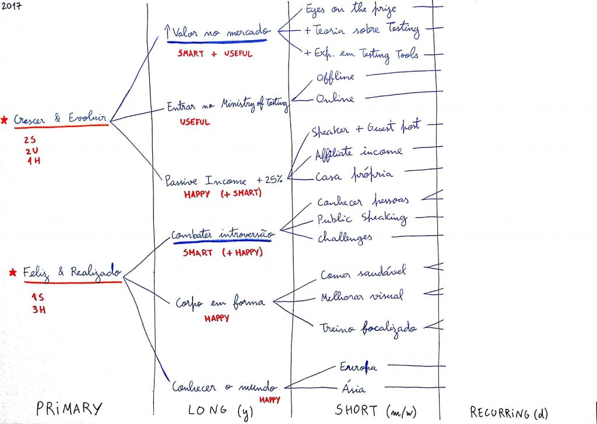
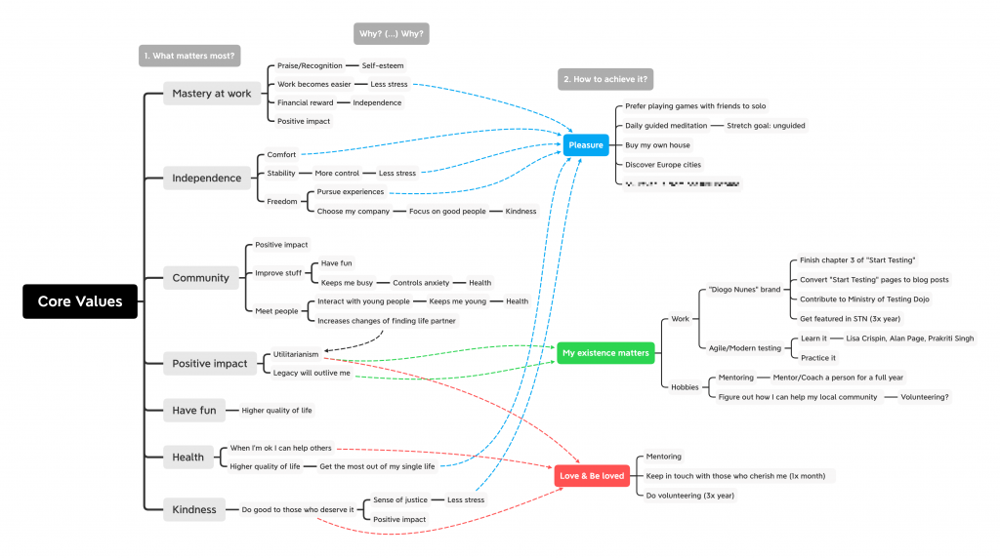

In 2018 I started listing my [new year resolutions](https://en.wikipedia.org/wiki/New_Year%27s_resolution). After school you're pretty much on your own. If you don't set yourself some goals the years will go by in a blink and your routine takes control of your life.

## "Happy–Smart–Useful" technique

[Derek Sivers](https://sive.rs/) is one of my idols and an inspiration on how to live.

His post ["Happy, Smart and Useful"](https://sive.rs/hsu) was actually the trigger for my first new year resolutions. Here's how I use it:

1. Define your primary goals
2. Break down each goal into statements that should be true by the end of the year
3. Detail what you can do monthly to make them happen
4. Go one step further and list daily activities that will fulfil your monthly goals
5. Review each yearly/monthly goal and try to classify them as happy, smart or useful
6. Count the number of goals in each category
7. Check if you're happy with the balance - if not, go back to step 1 and review your goals

I find this approach very valuable. The process is simple and objective. Since you go from yearly to daily goals, it makes your objectives measurable and grounded. And it nudges you to strike a balance between work and leisure.

## "Core values" technique

While I was researching for my book ["Purpose"](/books) I found this approach by [Charles Moore](https://medium.com/@charlesmoore_69451/life-tool-a-framework-for-personal-success-and-fulfillment-fae60f28ab79).

I think this approach is particularly suited for people who are not sure what motivates them or what their goals should be. It's done in two phases:

- Phase 1: Identify your **core values**
  - What matters to me the most? Why? (ask why 5 times to get to the core)
  - What brings me contentment (e.g. happiness, fulfilment, relaxation)?
  - Who is around me in moments of contentment?
  - What is preventing or limiting my contentment?
- Phase 2: Define a **benchmark** for each core value
  - What does it mean to "succeed" in that value?
  - What needs to happen to improve that value?
  - Is your definition of success clear and measurable?

## Now that you have your _wishlist_...

... it's time to make it happen! Planning is only 20% of the effort. Be accountable. Remind yourself what you're trying to achieve and why.

In my case, I convert my goals into a mind map, I print it and pin it to the fridge's door. Now you have an excuse to use that fridge magnet you got on your last trip. If that's too public for you, get some [Patafix](https://amzn.to/38CQopz) and glue it to your wardrobe door.

Good luck!
