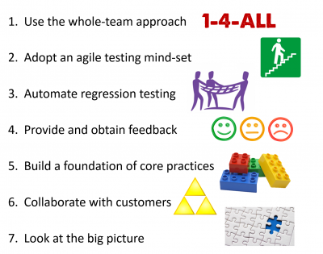

_This post is part of the ["Testing for Agile Teams" series](/blog/?s=Testing+for+Agile+Teams)_.

> Incrementally delivering business value, through short iterations (SCRUM) and virtuous loops of feedback (XP). Roles' boundaries are blurred, everyone's focused on quality.
>
> Testers help customers clarify requirements, turn those into tests that guide development, and provide a holistic viewpoint to the team.

## Key Success Factors

Explanation below.

## 1\. Use the whole-team approach

- **The whole team takes responsibility for quality.**
- You have a large variety of skills and experience levels focused on delivering value.
- The team develops testable code, right from the start.
- Try the "Power of Three" -- a tester, a programmer, and a business expert.

## 2\. Adopt an agile testing mind-set

- On an agile team, programmers test and testers do everything at their reach to help the team deliver the best possible product.
- Focus on the team’s goals and help everyone do their best work.
- Always try the simplest approach. Focus on delivering value.
- Development should be people-centric and enjoyable.
- **Continuously find better ways to work** -- read books, blogs, go to meetups, communicate, try.

## 3\. Automate regression testing

- **Make time** to do exploratory testing by automating everything else.
- Automating regression tests is a team effort (Agile Testing Quadrants + Test Automation Pyramid).
- It will be hard and hurt at first.

## 4\. Provide and obtain feedback

- Provide constant feedback in order to keep the team on track.
- Ask developers if they get enough information from tests/examples.
- Ask customers if they feel their quality criteria are being met.

## 5\. Build a foundation of core practices

- Continuous integration.
- Test environments.
- Manage technical debt.
- Working incrementally.
- Coding and testing are part of one process.
- Synergy between practices.

## 6\. Collaborate with customers

- Clarify and prioritize requirements.
- Illustrate requirements with examples.
- Convert those examples into executable tests.
- Never get in the way against "Power of Three".

## 7\. Look at the big picture

- Testers tend to look at the big picture, and usually from a customer point of view.
- Someone has to consider the impact to the larger system.
- Help your team take a step back now and then.

* * *

_This post is a personal summary of a chapter from the book [Agile Testing: A Practical Guide For Testers And Agile Teams](http://www.amazon.co.uk/gp/product/0321534468/ref=as_li_tl?ie=UTF8&camp=1634&creative=6738&creativeASIN=0321534468&linkCode=as2&tag=dionun-21). I'm sure you'll find that book useful too._
