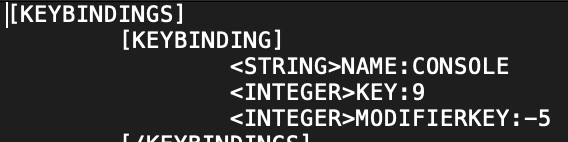

Torchlight 2 is a "hack and slash" game with a lot of grinding involved. My group of friends and me decided to cheat on our last day playing the game, so we could have a taste of that sweet loot before uninstalling the game. I think it's fair

To use cheats you will need to:

1. Enable the development console
2. Go into single player mode
3. Type cheat codes

These instructions will work if you installed the game through **Epic Games** on a **Mac**.

_Note: Even though you need to be in a single player (offline) instance to use the cheats, everything you get through cheating will carry on to your multiplayer sessions (online)._

## Enable the console

This is the hardest part. You need to find the location of your `settings.txt` file.

- There's a path `/Users/Shared/Epic Games/Torchlight2/Torchlight 2` which contains a `settings.txt` file. Ignore it.
- Instead, go to `~/Library/Application Support/Runic Games/Torchlight 2`
  - Or run `cd ~/Library/Application\ Support/Runic\ Games/Torchlight\ 2` on a terminal

Inside this folder you should see a file named `settings.txt`.

- Open the file and change the lines:
  - `Console:0` to `Console:1`
  - `Debugmenus:0` to `Debugmenus:1`
- Save the file and close it

## Rebind the console shortcut

For Windows users, the console is opened by pressing the `Insert` key. Mac users don't have that key, so we need to rebind it.

- Copy the original `keybindings_sdl2.dat` file and append `.backup` to its name
- Open the `keybindings_sdl2.dat` file for editing (use TextEdit or a similar editor)
- Search for `NAME:CONSOLE`
- Edit that section so that your configuration looks like this:

- Save the file and close it.

From now on, the shortcut ⇧F will open the console.

## Use the console

- Start the game
- Choose single player session
- Wait until you enter the game world
- To open the console, press `Shift + F` or `⇧F`

You should see the dev console and be able to type and submit cheat codes.

## Cheat codes

But which codes can you use? There are several lists online for Torchlight 2: try [IGN](https://www.ign.com/wikis/torchlight-2/PC_Cheats) or [Gamefaqs](https://gamefaqs.gamespot.com/pc/604445-torchlight-ii/cheats).

Happy cheating!
