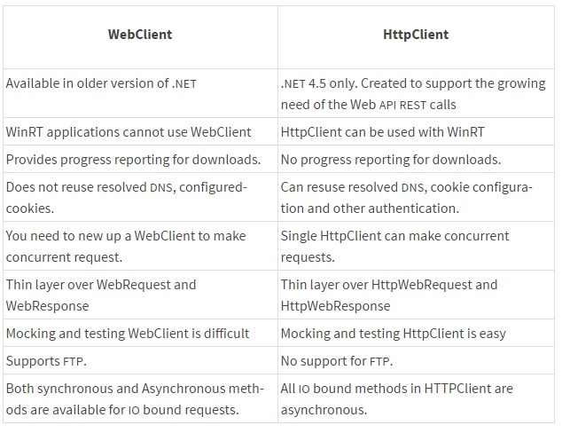

Just when I was starting to get used to call WebServices through WSDL - like I showed [here](/blog/calling-a-web-method-in-c-without-a-service-reference/) and [here](/blog/calling-webservice-without-wsdl-or-web-reference/) - I had to call a RESTful API. If you don't know what I'm talking about you're like me [a week ago](http://stackoverflow.com/a/840713/675577). Let's just say that:

- a **WSDL** API uses **SOAP** to exchange **XML**\-encoded data
- a **REST** API uses **HTTP** to exchange **JSON**\-encoded data

That's a whole new paradigm. Instead of `GetObject()` and `SetObject()` methods you have a single url `api/object` that may receive either an `HTTP GET` request or an `HTTP POST` request.

The .NET framework offers you three different classes to consume REST APIs: `HttpWebRequest`, `WebClient`, `HttpClient`. To worsen your [analysis paralysis](http://en.wikipedia.org/wiki/Analysis_paralysis) the open-source community created yet another library called `RestSharp`. Fear not, I'll ease your choice.

### In the beginning there was... HttpWebRequest


This is the standard class that the .NET creators originally developed to consume HTTP requests. Using `HttpWebRequest` [gives you control](http://stackoverflow.com/a/8237452/675577) over every aspect of the request/response object, like timeouts, cookies, headers, protocols. Another great thing is that `HttpWebRequest` class does not block the user interface thread. For instance, while you're downloading a big file from a sluggish API server, your application's UI will remain responsive.

However, **with great power comes great complexity.** In order to make a simple `GET` you need at least five lines of code; we will see that `WebClient` uses just two lines.

```
HttpWebRequest http = (HttpWebRequest)WebRequest.Create("http://example.com");
WebResponse response = http.GetResponse();

MemoryStream stream = response.GetResponseStream();
StreamReader sr = new StreamReader(stream);
string content = sr.ReadToEnd();
```

The number of ways you can make a mistake with `HttpWebRequest` is truly astounding. Only use `HttpWebRequest` if you require the additional low-level control that it offers.

### WebClient. Simple.


`WebClient` is a higher-level abstraction built on top of `HttpWebRequest` to [**simplify the most common tasks**](http://stackoverflow.com/a/22792326/675577). Using `WebClient` is potentially slower (on the order of a few milliseconds) than using `HttpWebRequest` directly. But that "inefficiency" comes with huge benefits: it requires [less code](http://www.c-sharpcorner.com/uploadfile/dhananjaycoder/webclient-and-httpwebrequest-class/), is easier to use, and you're less likely to make a mistake when using it. That same request example is now as simple as:

```
var client = new WebClient();
var text = client.DownloadString("http://example.com/page.html");
```

_Note: the using statements from both examples were omitted for brevity. You should definitely dispose your web request objects properly._

Don't worry, you can still specify timeouts, just make sure you [follow this workaround](http://stackoverflow.com/questions/601861/set-timeout-for-webclient-downloadfile/3052637#3052637).

### HttpClient, the best of both worlds



`HttpClient` provides powerful functionality with better syntax support for newer threading features, e.g. it supports the `await` keyword. It also enables threaded downloads of files with better compiler checking and code validation. For a complete listing of the advantages and features of this class make sure you read [this SO answer](http://stackoverflow.com/a/27737601/675577).

The only downfall is that it requires .NET Framework 4.5, which many older or legacy machines might not have.

### Wait, a new contestant has appeared!


Since `HttpClient` is only available for the .NET 4.5 platform the community developed an alternative. Today, [`RestSharp`](http://restsharp.org/) is one of the only options for a portable, multi-platform, unencumbered, fully open-source HTTP client that you can use in all of your applications.

It combines the control of `HttpWebRequest` with the simplicity of `WebClient`.

### Conclusion

- `HttpWebRequest` for control
- `WebClient` for simplicity and brevity
- `RestSharp` for both on non-.NET 4.5 environments
- `HttpClient` for both + async features on .NET 4.5 environments
