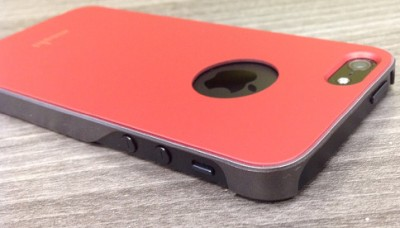
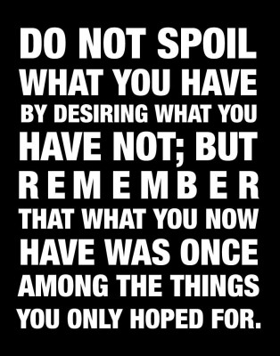
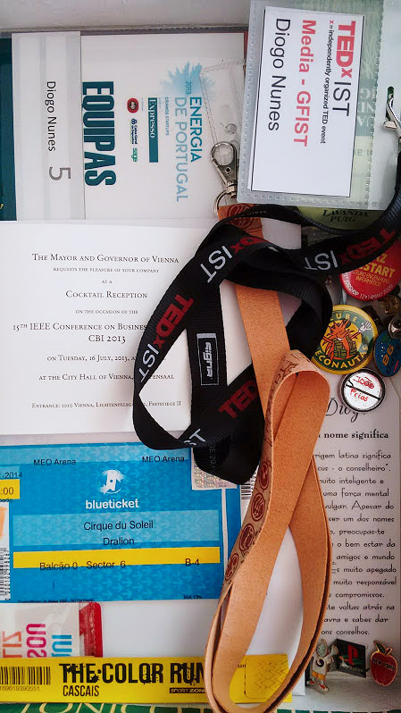
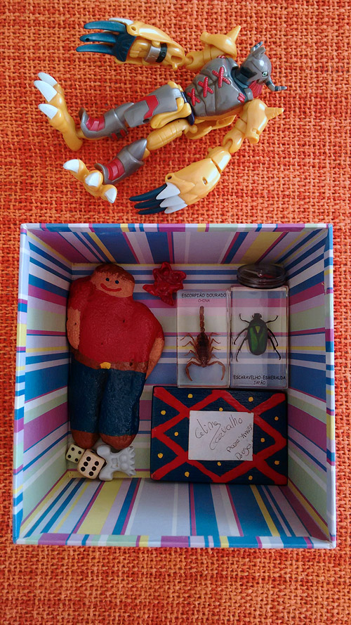

### Don't let anyTHING become precious to you.

Over the last years -- influenced by [talks](http://youtu.be/L8YJtvHGeUU) and [websites](http://www.becomingminimalist.com/becoming-minimalist-start-here/) and other personal experiences -- I've developed my minimalist side. In my youth I was a stuff collector (["acumula tralha"](https://www.youtube.com/watch?v=n6rlyfirVDA)). That was how everyone was raised at the time, e.g. goods were scarse and repairing was always cheaper than buying a new one.

> Keep it, it may come in handy one of these days.

And since everyone had so little, owning stuff was empowering. And when quality was not affordable, quantity would suffice it. **Every house had its collection of [bibelots](http://www.thefreedictionary.com/bibelot), its shire of stuff**. Surely that's an instinctive nature that we inherited from our primitive anchestors.

Our animal side still likes to show off and social networks are there to help [`#braggie`](http://www.dailymail.co.uk/sciencetech/article-2511167/Forget-selfies--BRAGGIE-One-upload-photos-social-networks-just-off.html). That's why people buy expensive iStuff and carefully protect them with premium covers but never cover up the brand's logo! And smart watches that need a smart phone nearby to work? Thankfully they don't require a smart person.

### Stuff owns you

What does an addict reply everytime you ask him or her to stop?

> Well I can stop whenever I want.

Except they don't. And people also get addicted to stuff. Some get addicted to buying things and others to owning them -- even though they never use them, never look at them, they're at peace as long as they own them.

Do you buy a car or does it adopt you? Is you car (1) an object that allows you to get from A to B or (2) a precious machine that matches your personality and represents your status?

Do you passionately desire to buy something, something that everyone seems to have? And when you finally buy it you barely care about finding a use for it?

**My most precious stuff are things that are worthless to anybody.** They are not kept at a bank safe, since they have no value. They are stored inside a shoe box. What does it contain? A painted rock, a broken toy, some pins, several pieces of paper, and [Cirque du Soleil](/blog/how-i-met-cirque-du-soleil/) tickets. **The real value is not in the items but in the memories associated.**

### Free yourself

The physical world is ephemeral, therefore you should minimize the number of _strings_ that tie you to that world. The more things you have and surround yourself with, the more fear you'll have about losing them. When you truly realize that one day you'll die and leave all that stuff behind you might lose your mind.

> You should invest in experiences, not stuff. Things devaluate while experiences last as long as your spirit. Even better, as time passes by, you'll recall them to be nicer than they really were.
> [59 Seconds: Change Your Life in Under a Minute](http://www.amazon.com/gp/product/0307474860/ref=as_li_tl?ie=UTF8&camp=1789&creative=390957&creativeASIN=0307474860&linkCode=as2&tag=thegeegec00-20&linkId=EGQCMY3FUHIKIZQJ)

### Challenge yourself

A new year has begun, a great time for you to cut down on stuff. Put aside things you no longer use, clothes you no longer wear. Free your spirit and make someone else happier by donating them. Look for redundant stuff in your home. If you have a smartphone why do you need that old calculator? If you have a laptop why do you need a desktop computer? If you have a tablet why do you need a kitchen TV?

Make it a game: **the more you give away the more _karma points_ you get!** If you find hard to donate all this ~precious~ irrelevant stuff then sell them on secondhand websites! At first you might get a feeling of emptyness or regret. Endure for a moment and let the feelings of freedom and fulfillment warm your spirit. Remember those karma points, they really work ;)

Enjoy you're new [satisfied mind](https://www.youtube.com/watch?v=QphglQu3oL0) listening to this song:

> How many times have, You heard someone say
> If I had his money, I could do things my way
> Money can't buy back, Your youth when you're old
> Or a friend when you're lonely, Or a love that's grown cold
> Then suddenly it happened, I lost every dime
> But I'm richer by far, With a satisfied mind
> [Johnny Cash - Satisfied Mind](https://www.youtube.com/watch?v=QphglQu3oL0)
