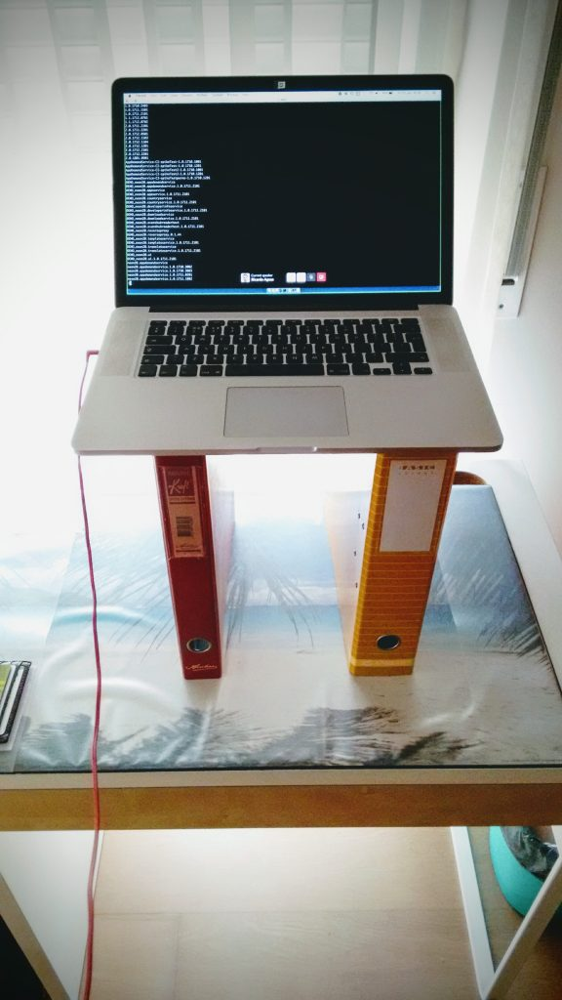
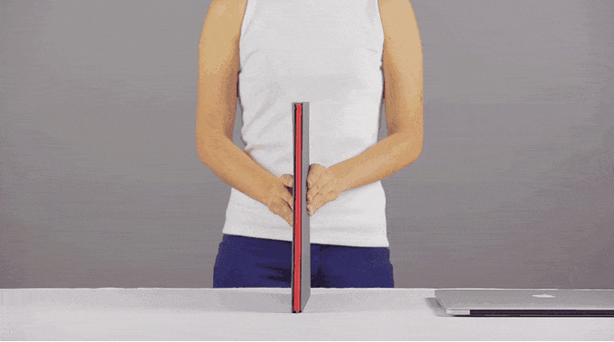
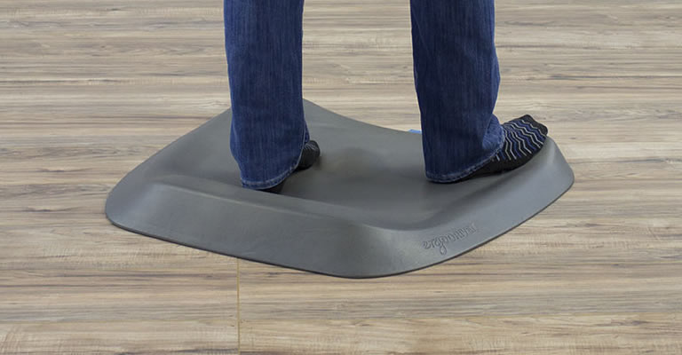

## Repurpose your normal desk with as low as 30€.

I spend 8 hours a day working seated. I have about 3 hours of meals and 3 hours of commute a day. That means I may easily spend 14 hours sitting (plus 8 sleeping).

[That's bad, no doubt.](https://youtu.be/jOJLx4Du3vU) To mitigate that I try to [replace some of that time with standing](https://lifehacker.com/5879536/how-sitting-all-day-is-damaging-your-body-and-how-you-can-counteract-it). When commuting, I always stand. When having meals, at home or at the mall, I use the "bar table" to eat while standing. It's not as uncomfortable as it sounds.

The strategy is to cut sitting time whenever possible. A small but frequent change like this has a big impact long-term.

## The goal

At work I have a proper standing desk, but at home I have one of those old table + bookcase furniture, which makes impossible any standing set up. When working I use my laptop most of times... if only I could find a way to raise it...

## Prototype

My DIY prototype costed me 6€, with just two files. It's more stable than it looks and gets the job done `#minimalist` `#desenrascanço`

**Caveat:** However, the constant pressure weight of my arms started deforming the files. So I found the perfect replacement: [Levit8](https://amzn.to/2FJUFrX).

## Solution

It's fast to set up and easy to fold and put it away. I ordered from Amazon, as it was cheaper than buying directly from the brand ‍♂️

**Caveat:** While that worked great, my heels started complaining. At work, the floor is soft carpet so this (first world) problem never occurred before. The solution was a standing mat: [Topo](https://amzn.to/2Ob6hWT).

## Better solution

There are cheaper and totally fat alternatives to this mat. I decided that Ergodriven deserved my 100€ because their design naturally makes your legs and feet change position once in a while. That's great on your joints because it releases the tension that builds up after you stand still for a long time.

## Best solution

That's it. With 130€ I was able to convert an average 40€ desk into a standing desk. It's still lower than the cheapest standing desk from IKEA.

Is this combo perfect? **No, it has a major flaw.** I'm still looking down to the screen. That causes me neck pain at the end of the day. That will only be solved by a proper standing desk with a raised monitor.

One day...
